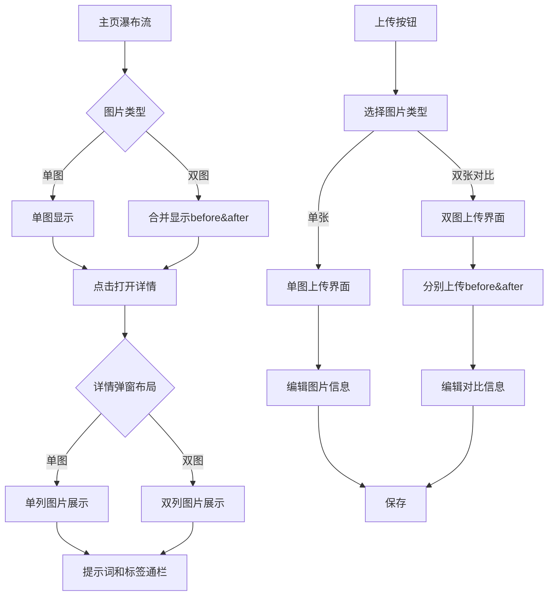

# Before & After 图片对比功能需求文档

## 1. 产品概述

本需求旨在扩展现有图片管理系统，新增before & after双图对比功能，同时优化现有的图片详情展示和上传流程。新功能将支持单图和双图两种类型，互不影响，为用户提供更丰富的图片对比展示能力。

## 2. 核心功能

### 2.1 用户角色
保持现有用户角色不变，所有用户均可使用单图和双图功能。

### 2.2 功能模块

本需求包含以下主要功能模块：
1. **图片详情弹窗优化**：移除link按钮默认focus，优化用户体验
2. **双图对比展示**：瀑布流中合并显示before & after图片
3. **图片详情弹窗重构**：双列展示两张图片，提示词和标签通栏布局
4. **上传流程优化**：支持图片类型选择（单张/双张对比）
5. **数据结构扩展**：扩展ImageData类型支持双图数据

### 2.3 页面详情

| 页面名称 | 模块名称 | 功能描述 |
|---------|---------|----------|
| 主页瀑布流 | 图片展示区域 | 支持单图和双图合并显示，双图以before&after形式呈现 |
| 图片详情弹窗 | 图片预览区域 | 单图：单列显示；双图：双列显示before和after图片 |
| 图片详情弹窗 | 操作按钮区域 | 移除link按钮默认focus，优化交互体验 |
| 图片详情弹窗 | 信息展示区域 | 提示词和标签通栏显示在图片下方，双图类型默认包含"指令"提示词块 |
| 上传弹窗 | 类型选择区域 | 新增图片类型选择：单张图片/双张对比图片 |
| 上传弹窗 | 文件上传区域 | 根据选择的类型显示不同的上传界面，双图需分别上传before和after |

## 3. 核心流程

### 用户操作流程

**单图上传流程：**
1. 用户点击上传按钮
2. 选择"单张图片"类型
3. 上传图片文件
4. 编辑图片信息（标题、描述、标签、提示词等）
5. 保存图片

**双图对比上传流程：**
1. 用户点击上传按钮
2. 选择"双张对比图片"类型
3. 分别上传before图片和after图片
4. 编辑图片信息（标题、描述、标签，默认包含"指令"提示词块）
5. 保存图片对比数据

**图片浏览流程：**
1. 用户在瀑布流中浏览图片
2. 单图正常显示，双图以合并形式显示
3. 点击图片打开详情弹窗
4. 单图：单列显示；双图：双列显示
5. 查看提示词和标签信息



## 4. 用户界面设计

### 4.1 设计风格
- **主色调**：保持现有设计风格，主色为黑色(#000000)，辅助色为白色(#FFFFFF)
- **按钮样式**：圆角矩形按钮，outline风格
- **字体**：系统默认字体，标题16px，正文14px
- **布局风格**：卡片式布局，双列网格展示
- **图标风格**：使用Lucide图标库，简洁线性风格

### 4.2 页面设计概览

| 页面名称 | 模块名称 | UI元素 |
|---------|---------|--------|
| 主页瀑布流 | 图片卡片 | 单图：正常卡片；双图：before&after合并卡片，带分割线或标识 |
| 图片详情弹窗 | 操作按钮 | 移除link按钮autoFocus属性，保持现有样式和布局 |
| 图片详情弹窗 | 图片展示区 | 单图：占用左侧面板；双图：左右分列展示，各占50%宽度 |
| 图片详情弹窗 | 信息区域 | 提示词列表和标签选择器通栏显示在图片下方 |
| 上传弹窗 | 类型选择 | 单选按钮组："单张图片" / "双张对比图片" |
| 上传弹窗 | 文件上传 | 双图模式：两个并排的拖拽上传区域，标注"Before"和"After" |

### 4.3 响应式设计
- **桌面优先**：主要针对桌面端设计
- **移动适配**：双图在移动端改为上下堆叠显示
- **触摸优化**：按钮和交互区域适配触摸操作

## 5. 数据结构设计

### 5.1 扩展ImageData类型

```typescript
// 图片类型枚举
export type ImageType = 'single' | 'comparison';

// 扩展后的图片数据类型
export interface ImageData {
  id: string;
  type: ImageType; // 新增：图片类型
  
  // 单图字段（type='single'时使用）
  storagePath?: string;
  url?: string;
  
  // 双图字段（type='comparison'时使用）
  beforeImage?: {
    storagePath: string;
    url: string;
  };
  afterImage?: {
    storagePath: string;
    url: string;
  };
  
  // 通用字段
  name: string;
  title?: string;
  description?: string;
  link?: string;
  tags: string[];
  promptBlocks: PromptBlock[];
  createdAt: string;
  updatedAt: string;
  status: 'ACTIVE' | 'ARCHIVED';
}

// 扩展FirestoreImage类型
export interface FirestoreImage {
  id: string;
  type: ImageType;
  storagePath?: string;
  url?: string;
  beforeImage?: {
    storagePath: string;
    url: string;
  };
  afterImage?: {
    storagePath: string;
    url: string;
  };
  name: string;
  description?: string;
  link?: string;
  tags: string[];
  promptBlocks: PromptBlock[];
  createdAt: any;
  updatedAt: any;
  status: 'ACTIVE' | 'ARCHIVED';
}
```

### 5.2 默认提示词配置

```typescript
// 双图类型默认提示词
export const DEFAULT_COMPARISON_PROMPT: PromptBlock = {
  id: 'default-instruction',
  title: '指令',
  content: '',
  color: 'blue' as ThemeColor,
  order: 0
};
```

## 6. 技术实现要点

### 6.1 组件修改清单

1. **ImageActions.tsx**
   - 移除link按钮的autoFocus属性
   - 保持现有功能和样式不变

2. **types/index.ts**
   - 扩展ImageData和FirestoreImage接口
   - 新增ImageType类型定义
   - 添加默认提示词配置

3. **image-modal.tsx**
   - 根据图片类型调整布局
   - 单图：保持现有布局
   - 双图：左右分列显示图片，信息区域通栏

4. **ImagePreview.tsx**
   - 支持双图展示模式
   - 添加before/after标识

5. **waterfall-image-grid.tsx**
   - 支持双图合并显示
   - 添加图片类型识别逻辑

6. **upload-modal.tsx**
   - 新增图片类型选择
   - 支持双图上传流程
   - 根据类型显示不同的上传界面

7. **API路由 (app/api/images/route.ts)**
   - 支持双图数据的存储和检索
   - 处理before/after图片的上传

### 6.2 存储策略

1. **文件存储**
   - 单图：保持现有存储路径结构
   - 双图：在同一目录下存储before和after图片
   - 命名规则：`{imageId}_before.{ext}` 和 `{imageId}_after.{ext}`

2. **数据库存储**
   - 使用type字段区分图片类型
   - 双图存储beforeImage和afterImage对象
   - 保持向后兼容，现有单图数据自动识别为type='single'

### 6.3 兼容性处理

1. **数据迁移**
   - 现有图片数据自动添加type='single'字段
   - 保持现有API接口兼容性

2. **渐进式升级**
   - 新功能不影响现有单图功能
   - 用户可以继续使用原有工作流程

### 6.4 性能优化

1. **图片加载**
   - 双图使用懒加载策略
   - 瀑布流中优先加载主图（after图片）

2. **缓存策略**
   - 双图数据使用相同的缓存机制
   - 合理利用浏览器缓存

## 7. 验收标准

### 7.1 功能验收

1. **基础功能**
   - ✅ 图片详情弹窗打开时link按钮不自动获得焦点
   - ✅ 上传时可以选择单张或双张对比类型
   - ✅ 双图上传支持分别选择before和after图片
   - ✅ 双图类型默认包含"指令"提示词块

2. **展示功能**
   - ✅ 瀑布流中双图以合并形式显示
   - ✅ 图片详情弹窗中双图双列展示
   - ✅ 提示词和标签在双图模式下通栏显示
   - ✅ 单图功能保持不变

3. **数据完整性**
   - ✅ 双图数据正确存储和检索
   - ✅ 现有单图数据兼容性良好
   - ✅ 标签、链接等关联数据功能正常

### 7.2 性能验收

1. **加载性能**
   - 双图加载时间不超过单图的2倍
   - 瀑布流滚动流畅，无明显卡顿

2. **交互性能**
   - 图片类型切换响应时间<200ms
   - 详情弹窗打开时间<300ms

### 7.3 兼容性验收

1. **浏览器兼容**
   - Chrome、Firefox、Safari、Edge最新版本
   - 移动端Safari和Chrome

2. **数据兼容**
   - 现有图片数据无损迁移
   - API接口向后兼容

## 8. 实施计划

### 阶段一：数据结构和基础组件（1-2天）
1. 扩展types定义
2. 修改ImageActions移除autoFocus
3. 更新API接口支持双图数据

### 阶段二：上传流程优化（2-3天）
1. 修改upload-modal支持类型选择
2. 实现双图上传界面
3. 处理文件存储逻辑

### 阶段三：展示功能实现（2-3天）
1. 修改瀑布流支持双图显示
2. 重构图片详情弹窗布局
3. 优化ImagePreview组件

### 阶段四：测试和优化（1-2天）
1. 功能测试和bug修复
2. 性能优化
3. 兼容性测试

**总计：6-10天**