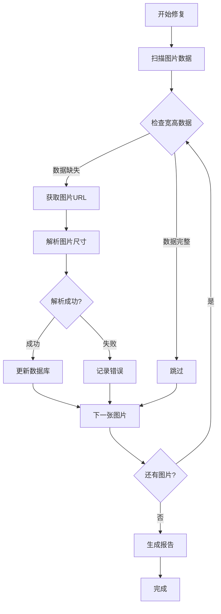

# 图片宽高数据修复功能产品需求文档

## 1. 产品概述

本功能旨在解决图片管理系统中图片宽高数据缺失的问题，确保所有图片都有准确的尺寸信息。通过改进上传流程和提供数据修复工具，提升系统数据完整性和用户体验。

主要解决的问题：数据库中图片的宽高字段值为0，影响图片展示和布局计算。

产品价值：提升图片管理系统的数据质量，为后续的图片展示优化和布局算法提供准确的基础数据。

## 2. 核心功能

### 2.1 用户角色

本功能主要面向系统管理员，不涉及普通用户的直接操作。

| 角色 | 权限 | 核心功能 |
|------|------|----------|
| 系统管理员 | 完全访问权限 | 执行数据修复、监控修复进度、查看修复报告 |

### 2.2 功能模块

图片宽高数据修复功能包含以下核心模块：

1. **上传优化模块**：改进图片上传时的元数据获取和存储
2. **数据修复模块**：批量修复现有图片的宽高数据
3. **监控报告模块**：提供修复进度和结果的可视化界面

### 2.3 页面详情

| 页面名称 | 模块名称 | 功能描述 |
|----------|----------|----------|
| **管理后台** | 数据修复控制面板 | 启动修复任务、查看修复进度、下载修复报告 |
| **管理后台** | 系统监控面板 | 监控上传成功率、元数据获取成功率、数据质量指标 |
| **上传界面** | 元数据预览 | 显示上传图片的尺寸信息、文件大小等元数据 |

## 3. 核心流程

### 3.1 图片上传流程（优化后）

1. 用户选择图片文件
2. 系统获取图片元数据（宽高、大小、格式）
3. 验证元数据完整性
4. 上传图片到存储服务
5. 保存完整的图片信息到数据库
6. 返回上传结果和元数据信息

### 3.2 数据修复流程

1. 管理员启动修复任务
2. 系统扫描所有图片记录
3. 识别宽高数据缺失的图片
4. 从图片URL获取实际尺寸
5. 批量更新数据库记录
6. 生成修复报告

### 3.3 流程图

## 4. 用户界面设计

### 4.1 设计风格

- **主色调**：蓝色系 (#3B82F6) 表示系统功能，绿色 (#10B981) 表示成功状态
- **辅助色**：橙色 (#F59E0B) 表示警告，红色 (#EF4444) 表示错误
- **按钮样式**：圆角矩形，带有微妙的阴影效果
- **字体**：系统默认字体，标题使用16px，正文使用14px
- **布局风格**：卡片式布局，清晰的分区和间距
- **图标风格**：线性图标，简洁明了

### 4.2 页面设计概览

| 页面名称 | 模块名称 | UI元素 |
|----------|----------|--------|
| **数据修复控制面板** | 修复任务控制 | 开始修复按钮（蓝色，大尺寸）、进度条、状态指示器、任务日志区域 |
| **数据修复控制面板** | 修复结果展示 | 统计卡片（总数、成功、失败）、结果表格、导出按钮 |
| **系统监控面板** | 数据质量监控 | 仪表盘图表、趋势图、警告提示、刷新按钮 |
| **上传界面** | 元数据预览 | 图片缩略图、尺寸标签、文件信息卡片、上传状态指示 |

### 4.3 响应式设计

- **桌面优先**：主要面向管理员在桌面环境使用
- **移动适配**：支持平板设备访问，手机端提供基础的监控功能
- **触摸优化**：按钮和交互元素适配触摸操作

## 5. 技术实现要点

### 5.1 图片元数据获取

- 支持PNG、JPEG、WebP格式的尺寸解析
- 服务器端二进制数据解析，无需浏览器环境
- 错误处理和回退机制

### 5.2 批量数据处理

- 分批处理避免内存溢出
- 事务处理确保数据一致性
- 进度跟踪和错误记录

### 5.3 性能优化

- 异步处理避免阻塞
- 缓存机制减少重复计算
- 限流控制保护服务器资源

## 6. 验收标准

### 6.1 功能验收

- [ ] 新上传的图片必须有正确的宽高数据
- [ ] 修复脚本能够成功处理所有现有图片
- [ ] 修复过程中的错误能够被正确记录和报告
- [ ] 管理界面能够显示修复进度和结果

### 6.2 性能验收

- [ ] 单张图片元数据获取时间 < 500ms
- [ ] 批量修复1000张图片时间 < 10分钟
- [ ] 修复过程中系统响应时间不受明显影响
- [ ] 内存使用量保持在合理范围内

### 6.3 数据质量验收

- [ ] 修复后宽高为0的图片数量 < 1%
- [ ] 修复的尺寸数据与实际图片尺寸一致
- [ ] 不同格式图片的解析准确率 > 95%

## 7. 风险评估

### 7.1 技术风险

- **图片格式兼容性**：某些特殊格式可能无法解析
  - 缓解措施：提供手动修正功能，记录无法解析的图片

- **大批量处理性能**：处理大量图片可能影响系统性能
  - 缓解措施：分批处理，限制并发数量，提供暂停/恢复功能

### 7.2 数据风险

- **数据更新失败**：部分图片更新可能失败
  - 缓解措施：事务处理，详细错误记录，支持重试机制

- **数据不一致**：修复过程中可能出现数据不一致
  - 缓解措施：原子操作，回滚机制，数据备份

## 8. 上线计划

### 8.1 开发阶段

**第1周**：图片解析功能开发和测试
- 实现多格式图片尺寸解析
- 单元测试和集成测试

**第2周**：上传流程优化
- 修改上传API集成新的元数据获取
- 测试上传流程的稳定性

**第3周**：修复工具开发
- 开发批量修复API和脚本
- 管理界面开发

**第4周**：测试和优化
- 全面测试和性能优化
- 文档完善和部署准备

### 8.2 部署阶段

**第5周**：灰度发布
- 小范围测试新的上传功能
- 监控系统稳定性和性能

**第6周**：数据修复
- 执行批量数据修复
- 验证修复结果

**第7周**：全量发布
- 全面启用新功能
- 持续监控和优化

## 9. 后续优化

### 9.1 功能扩展

- 支持更多图片格式（GIF、BMP、TIFF等）
- 添加图片质量评估功能
- 实现智能图片压缩建议

### 9.2 性能优化

- 实现增量修复，只处理新增或修改的图片
- 添加缓存机制，避免重复解析
- 优化数据库查询和更新策略

### 9.3 用户体验

- 提供更详细的修复进度展示
- 添加修复历史记录查询
- 实现自动化的定期数据质量检查

## 10. 成功指标

- **数据完整性**：图片宽高数据完整率达到99%以上
- **系统稳定性**：修复过程中系统可用性保持在99.9%以上
- **处理效率**：平均每张图片处理时间小于100ms
- **错误率**：图片解析错误率低于1%
- **用户满意度**：管理员对修复工具的满意度达到4.5分以上（5分制）