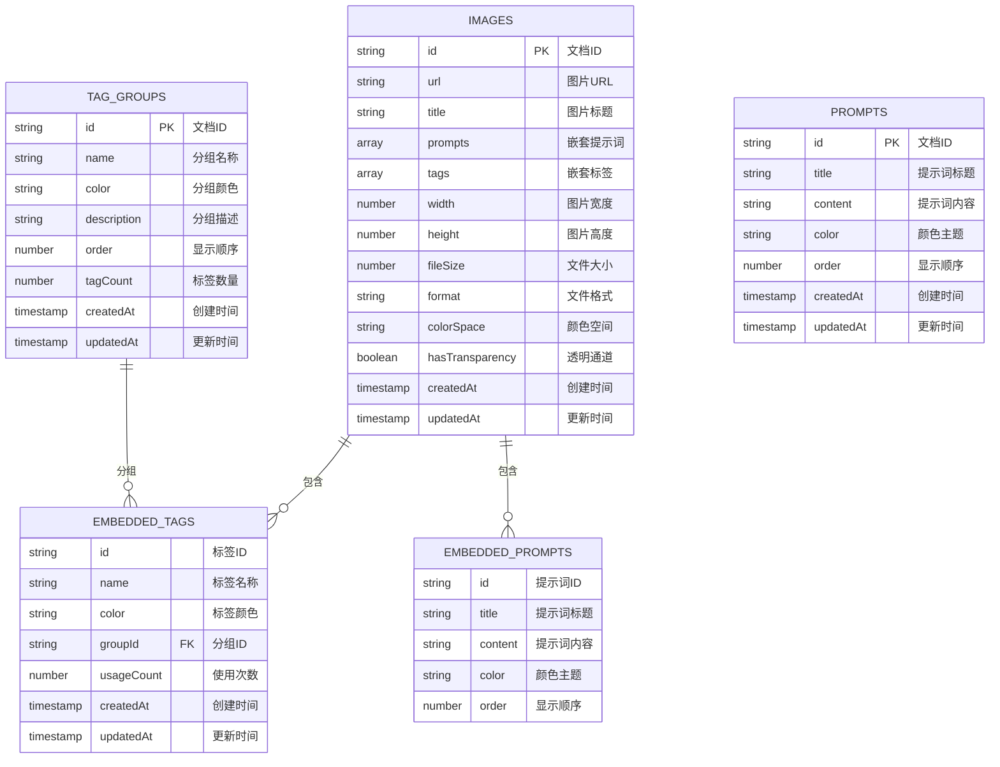
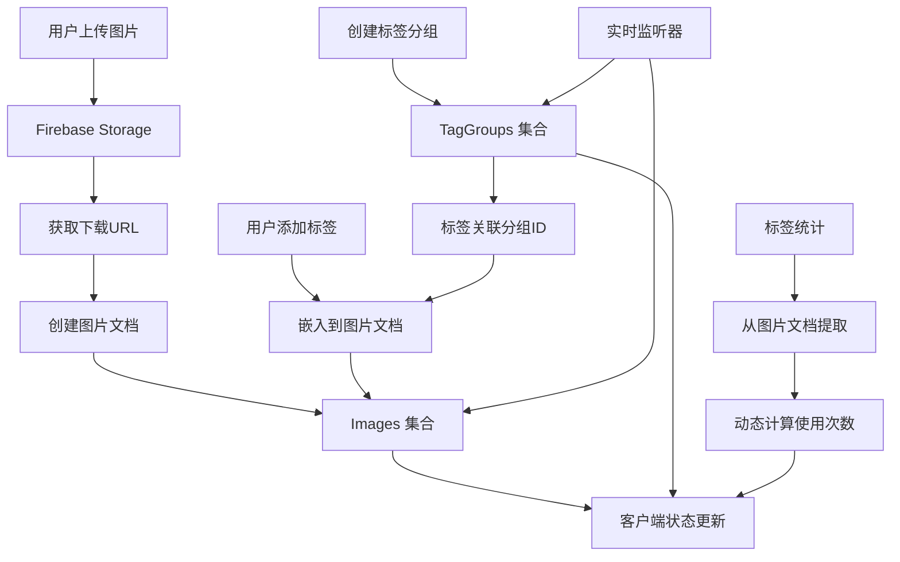

# Gooodcase 数据库设计文档

## 📋 目录

1. [数据库概述](#数据库概述)
2. [集合结构设计](#集合结构设计)
3. [数据关系图](#数据关系图)
4. [索引设计](#索引设计)
5. [数据操作模式](#数据操作模式)
6. [性能优化策略](#性能优化策略)
7. [安全规则](#安全规则)

---

## 数据库概述

### 🗄️ 技术选型

- **数据库**: Firebase Firestore (NoSQL 文档数据库)
- **存储**: Firebase Storage (文件存储服务)
- **实时同步**: Firestore 实时监听器
- **离线支持**: Firestore 离线持久化

### 🎯 设计原则

1. **非规范化设计**: 为了查询性能，适度冗余数据
2. **嵌套数据**: 相关数据嵌套存储，减少查询次数
3. **实时同步**: 利用 Firestore 的实时特性
4. **扁平化集合**: 避免过深的嵌套结构
5. **索引优化**: 根据查询模式设计索引

---

## 集合结构设计

### 📊 集合概览

```
Firestore Database
├── images/              # 图片集合
├── tagGroups/           # 标签分组集合
├── prompts/             # 提示词集合 (预留)
└── metadata/            # 元数据集合 (预留)
```

### 🖼️ Images 集合

**集合路径**: `/images/{imageId}`

```typescript
interface ImageDocument {
  // 基本信息
  url: string;                    // 图片 URL (Firebase Storage)
  title: string;                  // 图片标题
  
  // 关联数据 (嵌套存储)
  prompts: Prompt[];              // 提示词数组
  tags: Tag[];                    // 标签数组
  
  // 图片元数据
  width: number;                  // 图片宽度 (像素)
  height: number;                 // 图片高度 (像素)
  fileSize: number;               // 文件大小 (字节)
  format: string;                 // 文件格式 (jpg, png, etc.)
  colorSpace: string;             // 颜色空间 (sRGB, etc.)
  hasTransparency: boolean;       // 是否有透明通道
  
  // 时间戳
  createdAt: Timestamp;           // 创建时间
  updatedAt: Timestamp;           // 更新时间
}
```

**示例文档**:
```json
{
  "url": "https://firebasestorage.googleapis.com/v0/b/project/o/images%2Fexample.jpg",
  "title": "美丽的风景照片",
  "prompts": [
    {
      "id": "prompt_1",
      "title": "风格",
      "content": "写实风格，高清画质",
      "color": "#3b82f6",
      "order": 0
    }
  ],
  "tags": [
    {
      "id": "tag_1",
      "name": "风景",
      "color": "#22c55e",
      "groupId": "group_nature",
      "usageCount": 15
    }
  ],
  "width": 1920,
  "height": 1080,
  "fileSize": 2048576,
  "format": "jpeg",
  "colorSpace": "sRGB",
  "hasTransparency": false,
  "createdAt": "2024-01-01T00:00:00.000Z",
  "updatedAt": "2024-01-01T00:00:00.000Z"
}
```

### 🏷️ TagGroups 集合

**集合路径**: `/tagGroups/{groupId}`

```typescript
interface TagGroupDocument {
  // 基本信息
  name: string;                   // 分组名称
  color: string;                  // 分组颜色 (十六进制)
  description?: string;           // 分组描述 (可选)
  
  // 排序和统计
  order: number;                  // 显示顺序
  tagCount: number;               // 包含的标签数量
  
  // 时间戳
  createdAt: Timestamp;           // 创建时间
  updatedAt: Timestamp;           // 更新时间
}
```

**示例文档**:
```json
{
  "name": "自然风光",
  "color": "#22c55e",
  "description": "自然风景相关的标签分组",
  "order": 1,
  "tagCount": 8,
  "createdAt": "2024-01-01T00:00:00.000Z",
  "updatedAt": "2024-01-01T00:00:00.000Z"
}
```

### 💭 Prompts 集合 (预留)

**集合路径**: `/prompts/{promptId}`

```typescript
interface PromptDocument {
  // 基本信息
  title: string;                  // 提示词标题
  content: string;                // 提示词内容
  color: string;                  // 颜色主题
  
  // 排序
  order: number;                  // 显示顺序
  
  // 时间戳
  createdAt: Timestamp;           // 创建时间
  updatedAt: Timestamp;           // 更新时间
}
```

### 📈 Metadata 集合 (预留)

**集合路径**: `/metadata/stats`

```typescript
interface MetadataDocument {
  // 统计信息
  totalImages: number;            // 图片总数
  totalTags: number;              // 标签总数
  totalPrompts: number;           // 提示词总数
  
  // 存储统计
  totalStorageUsed: number;       // 已使用存储空间 (字节)
  
  // 时间戳
  lastUpdated: Timestamp;         // 最后更新时间
}
```

---

## 数据关系图

### 🔗 实体关系图 (ERD)



### 🔄 数据流关系图



---

## 索引设计

### 📊 复合索引

#### 1. Images 集合索引

```javascript
// 按创建时间排序 (默认查询)
{
  collection: 'images',
  fields: [
    { field: 'createdAt', order: 'desc' }
  ]
}

// 按更新时间排序
{
  collection: 'images',
  fields: [
    { field: 'updatedAt', order: 'desc' }
  ]
}

// 按标题搜索 + 时间排序
{
  collection: 'images',
  fields: [
    { field: 'title', order: 'asc' },
    { field: 'createdAt', order: 'desc' }
  ]
}

// 标签过滤 + 时间排序 (数组包含查询)
{
  collection: 'images',
  fields: [
    { field: 'tags.name', arrayConfig: 'contains' },
    { field: 'createdAt', order: 'desc' }
  ]
}
```

#### 2. TagGroups 集合索引

```javascript
// 按显示顺序排序
{
  collection: 'tagGroups',
  fields: [
    { field: 'order', order: 'asc' }
  ]
}

// 按名称搜索
{
  collection: 'tagGroups',
  fields: [
    { field: 'name', order: 'asc' }
  ]
}
```

### 🔍 查询优化策略

#### 1. 分页查询
```typescript
// 使用 startAfter 进行分页
const query = query(
  collection(db, 'images'),
  orderBy('createdAt', 'desc'),
  limit(20),
  startAfter(lastDoc)
);
```

#### 2. 标签过滤查询
```typescript
// 使用 array-contains-any 查询多个标签
const query = query(
  collection(db, 'images'),
  where('tags.name', 'array-contains-any', selectedTags),
  orderBy('createdAt', 'desc')
);
```

#### 3. 文本搜索 (客户端过滤)
```typescript
// Firestore 不支持全文搜索，在客户端进行过滤
const filteredImages = images.filter(image => 
  image.title.toLowerCase().includes(searchQuery.toLowerCase()) ||
  image.tags.some(tag => 
    tag.name.toLowerCase().includes(searchQuery.toLowerCase())
  )
);
```

---

## 数据操作模式

### 🔄 实时监听模式

#### 1. 图片数据监听
```typescript
// 监听图片集合变化
const unsubscribe = onSnapshot(
  query(collection(db, 'images'), orderBy('createdAt', 'desc')),
  (snapshot) => {
    const images = snapshot.docs.map(doc => ({
      id: doc.id,
      ...doc.data()
    }));
    setImages(images);
  },
  (error) => {
    console.error('监听错误:', error);
  }
);
```

#### 2. 标签数据提取
```typescript
// 从图片数据中提取标签
const extractTags = (images: ImageData[]) => {
  const tagMap = new Map<string, Tag>();
  
  images.forEach(image => {
    image.tags.forEach(tag => {
      if (tagMap.has(tag.name)) {
        const existingTag = tagMap.get(tag.name)!;
        existingTag.usageCount = (existingTag.usageCount || 0) + 1;
      } else {
        tagMap.set(tag.name, { ...tag, usageCount: 1 });
      }
    });
  });
  
  return Array.from(tagMap.values())
    .sort((a, b) => (b.usageCount || 0) - (a.usageCount || 0));
};
```

### 📝 写入操作模式

#### 1. 单文档写入
```typescript
// 添加新图片
const addImage = async (imageData: Omit<ImageDocument, 'id'>) => {
  const docRef = await addDoc(collection(db, 'images'), {
    ...imageData,
    createdAt: serverTimestamp(),
    updatedAt: serverTimestamp()
  });
  return docRef.id;
};
```

#### 2. 批量写入
```typescript
// 批量操作
const batchWrite = async (operations: BatchOperation[]) => {
  const batch = writeBatch(db);
  
  operations.forEach(op => {
    const docRef = doc(db, op.collection, op.id);
    if (op.type === 'set') {
      batch.set(docRef, op.data);
    } else if (op.type === 'update') {
      batch.update(docRef, op.data);
    } else if (op.type === 'delete') {
      batch.delete(docRef);
    }
  });
  
  await batch.commit();
};
```

#### 3. 事务操作
```typescript
// 事务更新
const updateImageWithTransaction = async (imageId: string, updates: Partial<ImageDocument>) => {
  await runTransaction(db, async (transaction) => {
    const imageRef = doc(db, 'images', imageId);
    const imageDoc = await transaction.get(imageRef);
    
    if (!imageDoc.exists()) {
      throw new Error('图片不存在');
    }
    
    transaction.update(imageRef, {
      ...updates,
      updatedAt: serverTimestamp()
    });
  });
};
```

---

## 性能优化策略

### 🚀 查询优化

#### 1. 索引优化
- 为常用查询创建复合索引
- 避免不等式查询的性能问题
- 使用数组包含查询进行标签过滤

#### 2. 分页策略
```typescript
// 游标分页 (推荐)
const loadNextPage = async (lastDoc?: DocumentSnapshot) => {
  let q = query(
    collection(db, 'images'),
    orderBy('createdAt', 'desc'),
    limit(20)
  );
  
  if (lastDoc) {
    q = query(q, startAfter(lastDoc));
  }
  
  const snapshot = await getDocs(q);
  return {
    docs: snapshot.docs,
    lastDoc: snapshot.docs[snapshot.docs.length - 1]
  };
};
```

#### 3. 数据预加载
```typescript
// 预加载下一页数据
const preloadNextPage = async (currentLastDoc: DocumentSnapshot) => {
  const nextPageQuery = query(
    collection(db, 'images'),
    orderBy('createdAt', 'desc'),
    startAfter(currentLastDoc),
    limit(20)
  );
  
  // 在后台预加载
  getDocs(nextPageQuery).then(snapshot => {
    // 缓存到本地状态
    cacheNextPageData(snapshot.docs);
  });
};
```

### 💾 缓存策略

#### 1. 离线持久化
```typescript
// 启用离线持久化
import { enableNetwork, disableNetwork } from 'firebase/firestore';

// 启用离线支持
const enableOfflineSupport = async () => {
  try {
    await enableNetwork(db);
    console.log('离线支持已启用');
  } catch (error) {
    console.error('启用离线支持失败:', error);
  }
};
```

#### 2. 内存缓存
```typescript
// 简单的内存缓存实现
class DataCache {
  private cache = new Map<string, { data: any; timestamp: number }>();
  private ttl = 5 * 60 * 1000; // 5分钟过期
  
  set(key: string, data: any) {
    this.cache.set(key, {
      data,
      timestamp: Date.now()
    });
  }
  
  get(key: string) {
    const cached = this.cache.get(key);
    if (!cached) return null;
    
    if (Date.now() - cached.timestamp > this.ttl) {
      this.cache.delete(key);
      return null;
    }
    
    return cached.data;
  }
}
```

### 📊 监控和分析

#### 1. 查询性能监控
```typescript
// 查询性能监控
const monitorQuery = async (queryName: string, queryFn: () => Promise<any>) => {
  const startTime = performance.now();
  
  try {
    const result = await queryFn();
    const endTime = performance.now();
    
    console.log(`查询 ${queryName} 耗时: ${endTime - startTime}ms`);
    
    // 发送性能数据到监控服务
    sendPerformanceMetric(queryName, endTime - startTime);
    
    return result;
  } catch (error) {
    console.error(`查询 ${queryName} 失败:`, error);
    throw error;
  }
};
```

#### 2. 数据使用统计
```typescript
// 统计数据使用情况
const trackDataUsage = () => {
  const stats = {
    totalReads: 0,
    totalWrites: 0,
    cacheHits: 0,
    cacheMisses: 0
  };
  
  // 在查询时更新统计
  const incrementReads = () => stats.totalReads++;
  const incrementWrites = () => stats.totalWrites++;
  
  return { stats, incrementReads, incrementWrites };
};
```

---

## 安全规则

### 🛡️ Firestore 安全规则

#### 1. 开发环境规则
```javascript
rules_version = '2';
service cloud.firestore {
  match /databases/{database}/documents {
    // 开发环境 - 允许所有读写操作
    match /{document=**} {
      allow read, write: if true;
    }
  }
}
```

#### 2. 生产环境规则 (示例)
```javascript
rules_version = '2';
service cloud.firestore {
  match /databases/{database}/documents {
    // 图片集合
    match /images/{imageId} {
      allow read: if true; // 允许所有人读取
      allow write: if request.auth != null; // 需要认证才能写入
      
      // 验证数据结构
      allow create: if validateImageData(request.resource.data);
      allow update: if validateImageData(request.resource.data)
                   && resource.data.createdAt == request.resource.data.createdAt;
    }
    
    // 标签分组集合
    match /tagGroups/{groupId} {
      allow read: if true;
      allow write: if request.auth != null;
    }
    
    // 验证函数
    function validateImageData(data) {
      return data.keys().hasAll(['url', 'title', 'prompts', 'tags', 'createdAt', 'updatedAt'])
             && data.url is string
             && data.title is string
             && data.prompts is list
             && data.tags is list;
    }
  }
}
```

### 🔒 Firebase Storage 安全规则

```javascript
rules_version = '2';
service firebase.storage {
  match /b/{bucket}/o {
    // 图片文件
    match /images/{imageId} {
      allow read: if true; // 允许所有人读取图片
      allow write: if request.auth != null // 需要认证才能上传
                   && request.resource.size < 10 * 1024 * 1024 // 限制文件大小 10MB
                   && request.resource.contentType.matches('image/.*'); // 只允许图片文件
    }
  }
}
```

### 🔐 客户端安全措施

#### 1. 输入验证
```typescript
// 图片数据验证
const validateImageData = (data: any): data is ImageDocument => {
  return (
    typeof data.url === 'string' &&
    typeof data.title === 'string' &&
    Array.isArray(data.prompts) &&
    Array.isArray(data.tags) &&
    typeof data.width === 'number' &&
    typeof data.height === 'number'
  );
};

// 文件类型验证
const validateImageFile = (file: File): boolean => {
  const allowedTypes = ['image/jpeg', 'image/png', 'image/gif', 'image/webp'];
  const maxSize = 10 * 1024 * 1024; // 10MB
  
  return (
    allowedTypes.includes(file.type) &&
    file.size <= maxSize
  );
};
```

#### 2. XSS 防护
```typescript
// HTML 内容清理
import DOMPurify from 'dompurify';

const sanitizeHtml = (html: string): string => {
  return DOMPurify.sanitize(html, {
    ALLOWED_TAGS: ['b', 'i', 'em', 'strong'],
    ALLOWED_ATTR: []
  });
};

// 用户输入清理
const sanitizeUserInput = (input: string): string => {
  return input
    .trim()
    .replace(/[<>"'&]/g, (char) => {
      const entities: Record<string, string> = {
        '<': '&lt;',
        '>': '&gt;',
        '"': '&quot;',
        "'": '&#x27;',
        '&': '&amp;'
      };
      return entities[char] || char;
    });
};
```

---

## 数据迁移和备份

### 📦 数据导出

```typescript
// 完整数据导出
const exportAllData = async (): Promise<ExportData> => {
  const [imagesResult, tagGroupsResult] = await Promise.all([
    getAllImages(),
    getAllTagGroups()
  ]);
  
  if (!imagesResult.success || !tagGroupsResult.success) {
    throw new Error('数据导出失败');
  }
  
  return {
    version: '1.0',
    exportDate: new Date().toISOString(),
    images: imagesResult.data || [],
    tagGroups: tagGroupsResult.data || [],
    metadata: {
      totalImages: imagesResult.data?.length || 0,
      totalTagGroups: tagGroupsResult.data?.length || 0
    }
  };
};
```

### 📥 数据导入

```typescript
// 批量数据导入
const importData = async (data: ExportData): Promise<BatchResult> => {
  const batch = writeBatch(db);
  let imported = 0;
  let failed = 0;
  
  // 导入图片数据
  for (const image of data.images) {
    try {
      const docRef = doc(collection(db, 'images'));
      batch.set(docRef, {
        ...image,
        createdAt: serverTimestamp(),
        updatedAt: serverTimestamp()
      });
      imported++;
    } catch (error) {
      console.error('导入图片失败:', error);
      failed++;
    }
  }
  
  // 导入标签分组数据
  for (const tagGroup of data.tagGroups || []) {
    try {
      const docRef = doc(collection(db, 'tagGroups'));
      batch.set(docRef, {
        ...tagGroup,
        createdAt: serverTimestamp(),
        updatedAt: serverTimestamp()
      });
      imported++;
    } catch (error) {
      console.error('导入标签分组失败:', error);
      failed++;
    }
  }
  
  await batch.commit();
  
  return {
    imported,
    failed,
    total: imported + failed
  };
};
```

### 🔄 增量备份

```typescript
// 增量备份 (基于时间戳)
const incrementalBackup = async (lastBackupTime: Date): Promise<ExportData> => {
  const imagesQuery = query(
    collection(db, 'images'),
    where('updatedAt', '>', Timestamp.fromDate(lastBackupTime))
  );
  
  const tagGroupsQuery = query(
    collection(db, 'tagGroups'),
    where('updatedAt', '>', Timestamp.fromDate(lastBackupTime))
  );
  
  const [imagesSnapshot, tagGroupsSnapshot] = await Promise.all([
    getDocs(imagesQuery),
    getDocs(tagGroupsQuery)
  ]);
  
  return {
    version: '1.0',
    exportDate: new Date().toISOString(),
    isIncremental: true,
    lastBackupTime: lastBackupTime.toISOString(),
    images: imagesSnapshot.docs.map(doc => ({ id: doc.id, ...doc.data() })),
    tagGroups: tagGroupsSnapshot.docs.map(doc => ({ id: doc.id, ...doc.data() })),
    metadata: {
      totalImages: imagesSnapshot.docs.length,
      totalTagGroups: tagGroupsSnapshot.docs.length
    }
  };
};
```

---

## 故障排除

### 🔧 常见问题

#### 1. 连接问题
```typescript
// 检查 Firestore 连接状态
const checkFirestoreConnection = async (): Promise<boolean> => {
  try {
    const testDoc = doc(db, 'test', 'connection');
    await getDoc(testDoc);
    return true;
  } catch (error) {
    console.error('Firestore 连接失败:', error);
    return false;
  }
};
```

#### 2. 权限问题
```typescript
// 检查权限
const checkPermissions = async (): Promise<{ read: boolean; write: boolean }> => {
  const permissions = { read: false, write: false };
  
  try {
    // 测试读权限
    await getDocs(query(collection(db, 'images'), limit(1)));
    permissions.read = true;
  } catch (error) {
    console.error('读权限检查失败:', error);
  }
  
  try {
    // 测试写权限
    const testDoc = doc(collection(db, 'test'));
    await setDoc(testDoc, { test: true });
    await deleteDoc(testDoc);
    permissions.write = true;
  } catch (error) {
    console.error('写权限检查失败:', error);
  }
  
  return permissions;
};
```

#### 3. 性能问题
```typescript
// 查询性能分析
const analyzeQueryPerformance = async () => {
  const queries = [
    { name: '获取最新图片', fn: () => getDocs(query(collection(db, 'images'), orderBy('createdAt', 'desc'), limit(20))) },
    { name: '获取标签分组', fn: () => getDocs(query(collection(db, 'tagGroups'), orderBy('order'))) }
  ];
  
  for (const { name, fn } of queries) {
    const startTime = performance.now();
    try {
      await fn();
      const endTime = performance.now();
      console.log(`${name}: ${endTime - startTime}ms`);
    } catch (error) {
      console.error(`${name} 失败:`, error);
    }
  }
};
```

---

## 版本历史

### v1.0
- 初始数据库设计
- 基础集合结构
- 实时监听功能
- 数据导入导出

### v1.1 (当前版本)
- 数据库版本管理优化
- IndexedDB schema 升级 (v6)
- 数据导出格式升级 (v2.1)
- 版本兼容性检查

### 未来版本规划

#### v1.2
- 添加全文搜索支持 (Algolia 集成)
- 优化查询性能
- 增加数据统计功能

#### v1.3
- 添加用户认证和权限管理
- 多租户支持
- 高级安全规则

#### v2.0
- 数据库架构重构
- 支持更复杂的查询
- 机器学习集成

---

**文档维护者**: 开发团队  
**文档版本**: v1.1  
**最后更新**: 2024-12-19  

*本文档将随着数据库架构的演进持续更新。*