# Gooodcase 数据流程图和时序图

## 📋 目录

1. [概述](#概述)
2. [核心数据流程](#核心数据流程)
3. [用户操作时序图](#用户操作时序图)
4. [系统交互流程](#系统交互流程)
5. [错误处理流程](#错误处理流程)
6. [性能优化流程](#性能优化流程)
7. [数据同步机制](#数据同步机制)

---

## 概述

### 🎯 文档目的

本文档详细描述了 Gooodcase 图片管理系统中的数据流向、操作时序和系统交互模式，帮助开发者理解系统的运行机制和数据处理逻辑。

### 📊 流程图说明

- **实线箭头**: 同步操作
- **虚线箭头**: 异步操作
- **双向箭头**: 双向数据流
- **粗线箭头**: 主要数据流
- **细线箭头**: 辅助数据流

---

## 核心数据流程

### 🖼️ 图片管理数据流

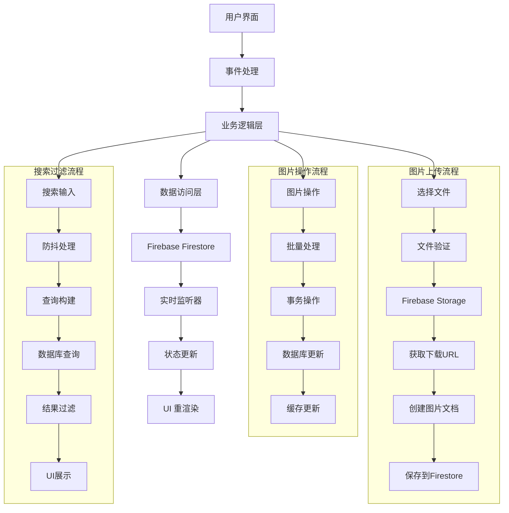
```mermaid
flowchart TD
    A[用户界面] --> B[事件处理]
    B --> C[业务逻辑层]
    C --> D[数据访问层]
    D --> E[Firebase Firestore]
    E --> F[实时监听器]
    F --> G[状态更新]
    G --> H[UI 重渲染]
    
    subgraph "图片上传流程"
        I[选择文件] --> J[文件验证]
        J --> K[Firebase Storage]
        K --> L[获取下载URL]
        L --> M[创建图片文档]
        M --> N[保存到Firestore]
    end
    
    subgraph "图片操作流程"
        O[图片操作] --> P[批量处理]
        P --> Q[事务操作]
        Q --> R[数据库更新]
        R --> S[缓存更新]
    end
    
    subgraph "搜索过滤流程"
        T[搜索输入] --> U[防抖处理]
        U --> V[查询构建]
        V --> W[数据库查询]
        W --> X[结果过滤]
        X --> Y[UI展示]
    end
    
    C --> I
    C --> O
    C --> T
```

### 🏷️ 标签管理数据流

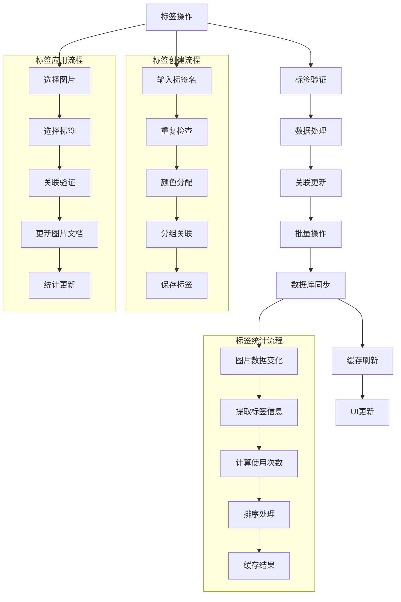
```mermaid
flowchart TD
    A[标签操作] --> B[标签验证]
    B --> C[数据处理]
    C --> D[关联更新]
    D --> E[批量操作]
    E --> F[数据库同步]
    F --> G[缓存刷新]
    G --> H[UI更新]
    
    subgraph "标签创建流程"
        I[输入标签名] --> J[重复检查]
        J --> K[颜色分配]
        K --> L[分组关联]
        L --> M[保存标签]
    end
    
    subgraph "标签应用流程"
        N[选择图片] --> O[选择标签]
        O --> P[关联验证]
        P --> Q[更新图片文档]
        Q --> R[统计更新]
    end
    
    subgraph "标签统计流程"
        S[图片数据变化] --> T[提取标签信息]
        T --> U[计算使用次数]
        U --> V[排序处理]
        V --> W[缓存结果]
    end
    
    A --> I
    A --> N
    F --> S
```

### 🔄 实时数据同步流程

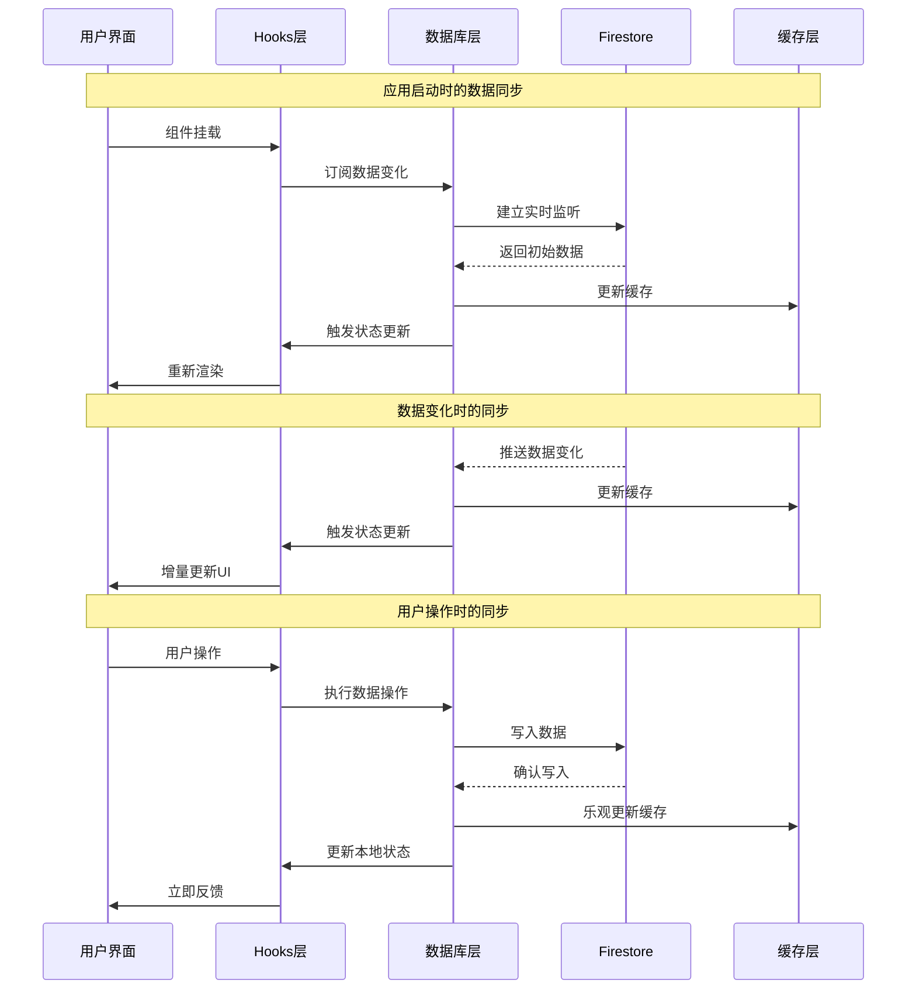
```mermaid
sequenceDiagram
    participant U as 用户界面
    participant H as Hooks层
    participant D as 数据库层
    participant F as Firestore
    participant C as 缓存层
    
    Note over U,C: 应用启动时的数据同步
    
    U->>H: 组件挂载
    H->>D: 订阅数据变化
    D->>F: 建立实时监听
    F-->>D: 返回初始数据
    D->>C: 更新缓存
    D->>H: 触发状态更新
    H->>U: 重新渲染
    
    Note over U,C: 数据变化时的同步
    
    F-->>D: 推送数据变化
    D->>C: 更新缓存
    D->>H: 触发状态更新
    H->>U: 增量更新UI
    
    Note over U,C: 用户操作时的同步
    
    U->>H: 用户操作
    H->>D: 执行数据操作
    D->>F: 写入数据
    F-->>D: 确认写入
    D->>C: 乐观更新缓存
    D->>H: 更新本地状态
    H->>U: 立即反馈
```

---

## 用户操作时序图

### 📤 图片上传时序图

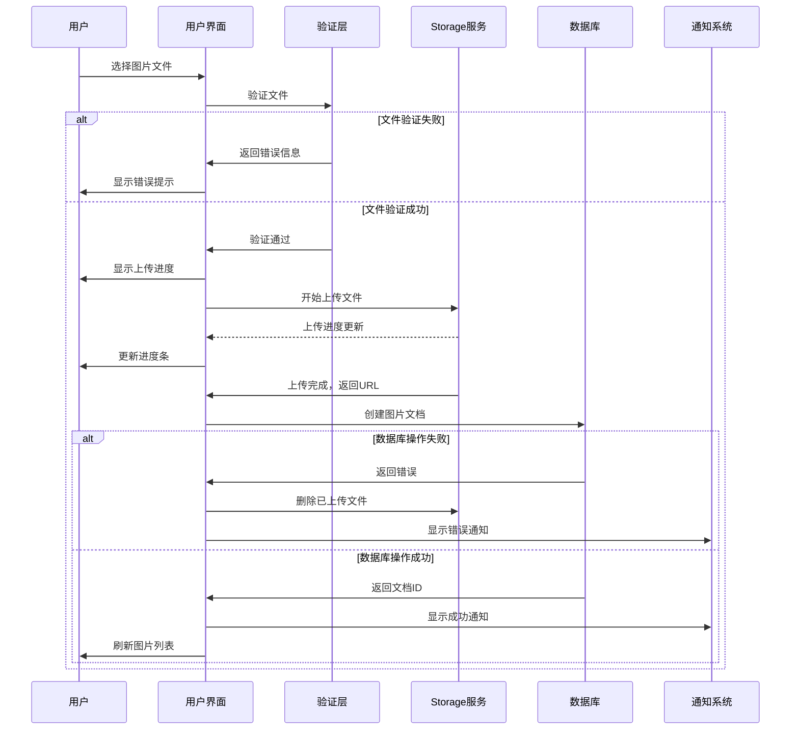
```mermaid
sequenceDiagram
    participant U as 用户
    participant UI as 用户界面
    participant V as 验证层
    participant S as Storage服务
    participant DB as 数据库
    participant N as 通知系统
    
    U->>UI: 选择图片文件
    UI->>V: 验证文件
    
    alt 文件验证失败
        V->>UI: 返回错误信息
        UI->>U: 显示错误提示
    else 文件验证成功
        V->>UI: 验证通过
        UI->>U: 显示上传进度
        
        UI->>S: 开始上传文件
        S-->>UI: 上传进度更新
        UI->>U: 更新进度条
        
        S->>UI: 上传完成，返回URL
        UI->>DB: 创建图片文档
        
        alt 数据库操作失败
            DB->>UI: 返回错误
            UI->>S: 删除已上传文件
            UI->>N: 显示错误通知
        else 数据库操作成功
            DB->>UI: 返回文档ID
            UI->>N: 显示成功通知
            UI->>U: 刷新图片列表
        end
    end
```

### 🔍 搜索操作时序图

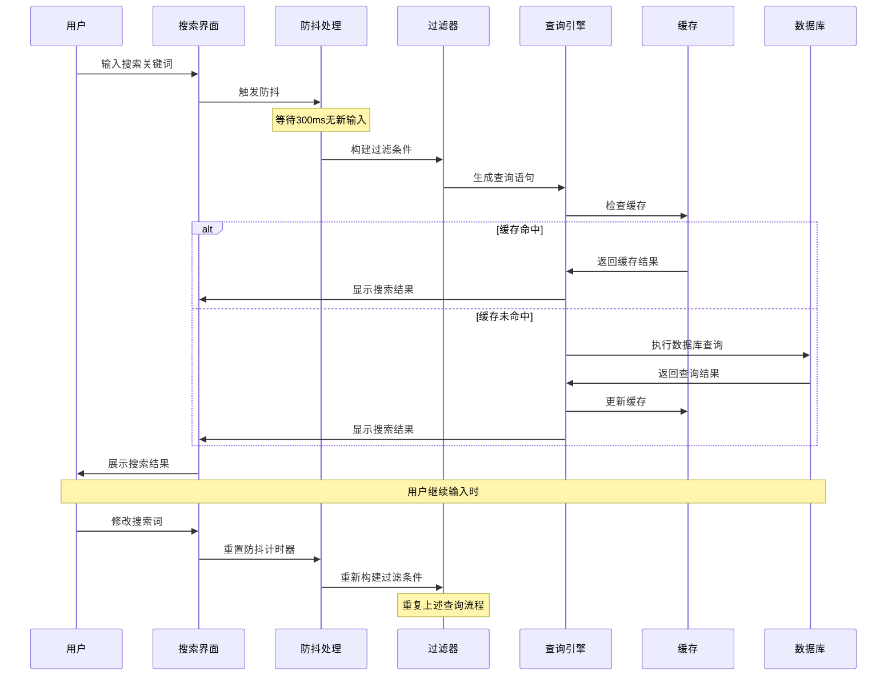
```mermaid
sequenceDiagram
    participant U as 用户
    participant UI as 搜索界面
    participant D as 防抖处理
    participant F as 过滤器
    participant Q as 查询引擎
    participant C as 缓存
    participant DB as 数据库
    
    U->>UI: 输入搜索关键词
    UI->>D: 触发防抖
    
    Note over D: 等待300ms无新输入
    
    D->>F: 构建过滤条件
    F->>Q: 生成查询语句
    
    Q->>C: 检查缓存
    
    alt 缓存命中
        C->>Q: 返回缓存结果
        Q->>UI: 显示搜索结果
    else 缓存未命中
        Q->>DB: 执行数据库查询
        DB->>Q: 返回查询结果
        Q->>C: 更新缓存
        Q->>UI: 显示搜索结果
    end
    
    UI->>U: 展示搜索结果
    
    Note over U,DB: 用户继续输入时
    
    U->>UI: 修改搜索词
    UI->>D: 重置防抖计时器
    D->>F: 重新构建过滤条件
    
    Note over F: 重复上述查询流程
```

### 🏷️ 标签管理时序图

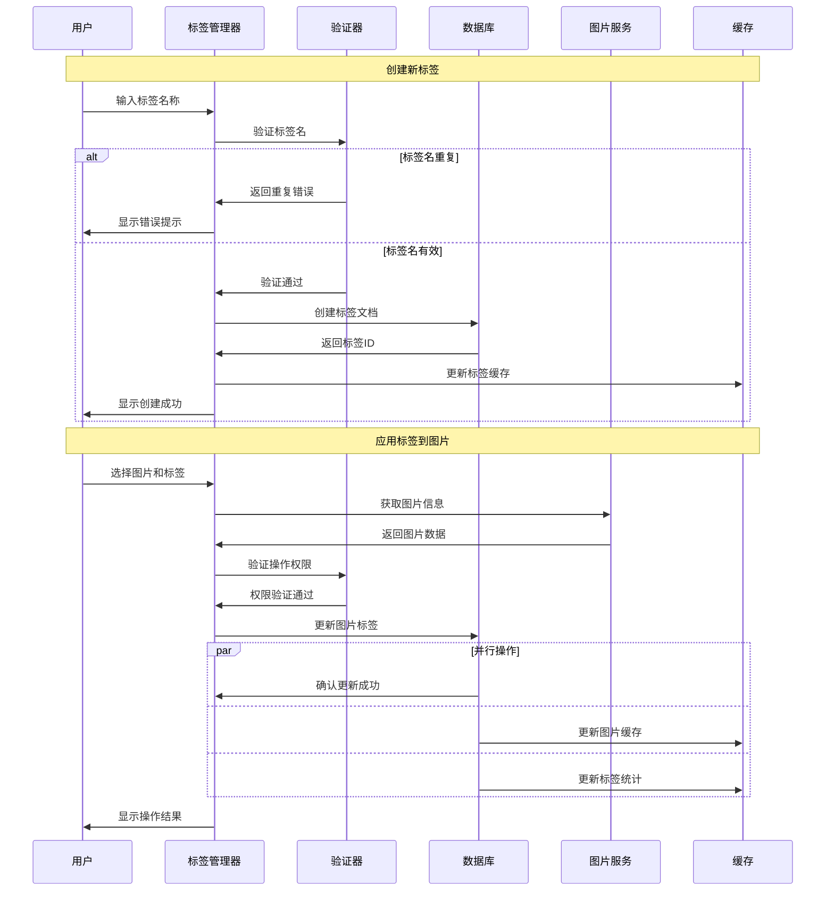
```mermaid
sequenceDiagram
    participant U as 用户
    participant TM as 标签管理器
    participant V as 验证器
    participant DB as 数据库
    participant IMG as 图片服务
    participant CACHE as 缓存
    
    Note over U,CACHE: 创建新标签
    
    U->>TM: 输入标签名称
    TM->>V: 验证标签名
    
    alt 标签名重复
        V->>TM: 返回重复错误
        TM->>U: 显示错误提示
    else 标签名有效
        V->>TM: 验证通过
        TM->>DB: 创建标签文档
        DB->>TM: 返回标签ID
        TM->>CACHE: 更新标签缓存
        TM->>U: 显示创建成功
    end
    
    Note over U,CACHE: 应用标签到图片
    
    U->>TM: 选择图片和标签
    TM->>IMG: 获取图片信息
    IMG->>TM: 返回图片数据
    TM->>V: 验证操作权限
    V->>TM: 权限验证通过
    
    TM->>DB: 更新图片标签
    
    par 并行操作
        DB->>TM: 确认更新成功
    and
        DB->>CACHE: 更新图片缓存
    and
        DB->>CACHE: 更新标签统计
    end
    
    TM->>U: 显示操作结果
```

### 🗑️ 批量删除时序图

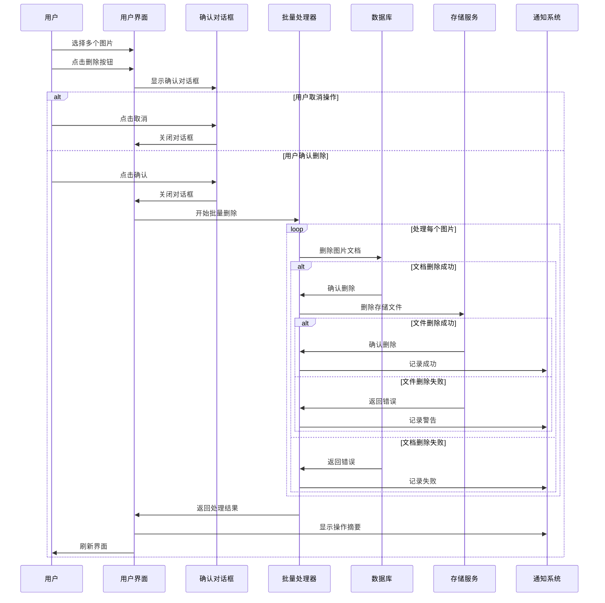
```mermaid
sequenceDiagram
    participant U as 用户
    participant UI as 用户界面
    participant C as 确认对话框
    participant B as 批量处理器
    participant DB as 数据库
    participant S as 存储服务
    participant N as 通知系统
    
    U->>UI: 选择多个图片
    U->>UI: 点击删除按钮
    UI->>C: 显示确认对话框
    
    alt 用户取消操作
        U->>C: 点击取消
        C->>UI: 关闭对话框
    else 用户确认删除
        U->>C: 点击确认
        C->>UI: 关闭对话框
        UI->>B: 开始批量删除
        
        loop 处理每个图片
            B->>DB: 删除图片文档
            
            alt 文档删除成功
                DB->>B: 确认删除
                B->>S: 删除存储文件
                
                alt 文件删除成功
                    S->>B: 确认删除
                    B->>N: 记录成功
                else 文件删除失败
                    S->>B: 返回错误
                    B->>N: 记录警告
                end
            else 文档删除失败
                DB->>B: 返回错误
                B->>N: 记录失败
            end
        end
        
        B->>UI: 返回处理结果
        UI->>N: 显示操作摘要
        UI->>U: 刷新界面
    end
```

---

## 系统交互流程

### 🔄 应用启动流程

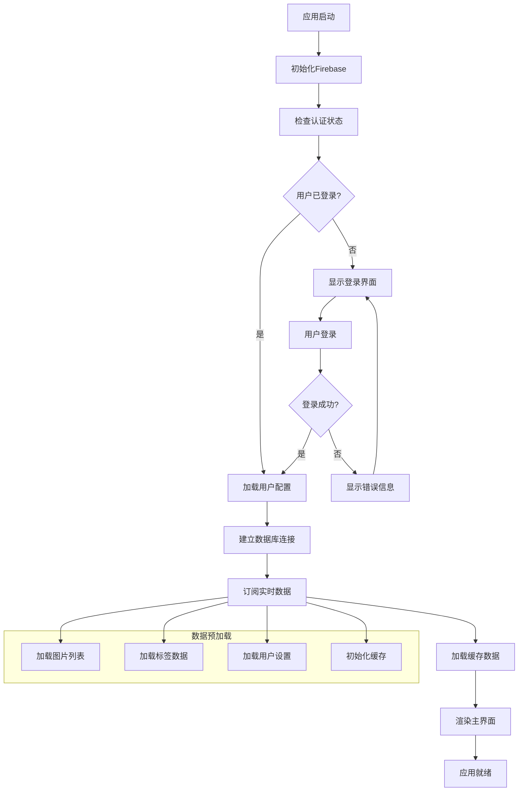
```mermaid
flowchart TD
    A[应用启动] --> B[初始化Firebase]
    B --> C[检查认证状态]
    C --> D{用户已登录?}
    
    D -->|是| E[加载用户配置]
    D -->|否| F[显示登录界面]
    
    E --> G[建立数据库连接]
    G --> H[订阅实时数据]
    H --> I[加载缓存数据]
    I --> J[渲染主界面]
    
    F --> K[用户登录]
    K --> L{登录成功?}
    L -->|是| E
    L -->|否| M[显示错误信息]
    M --> F
    
    J --> N[应用就绪]
    
    subgraph "数据预加载"
        O[加载图片列表]
        P[加载标签数据]
        Q[加载用户设置]
        R[初始化缓存]
    end
    
    H --> O
    H --> P
    H --> Q
    H --> R
```

### 📱 响应式布局流程

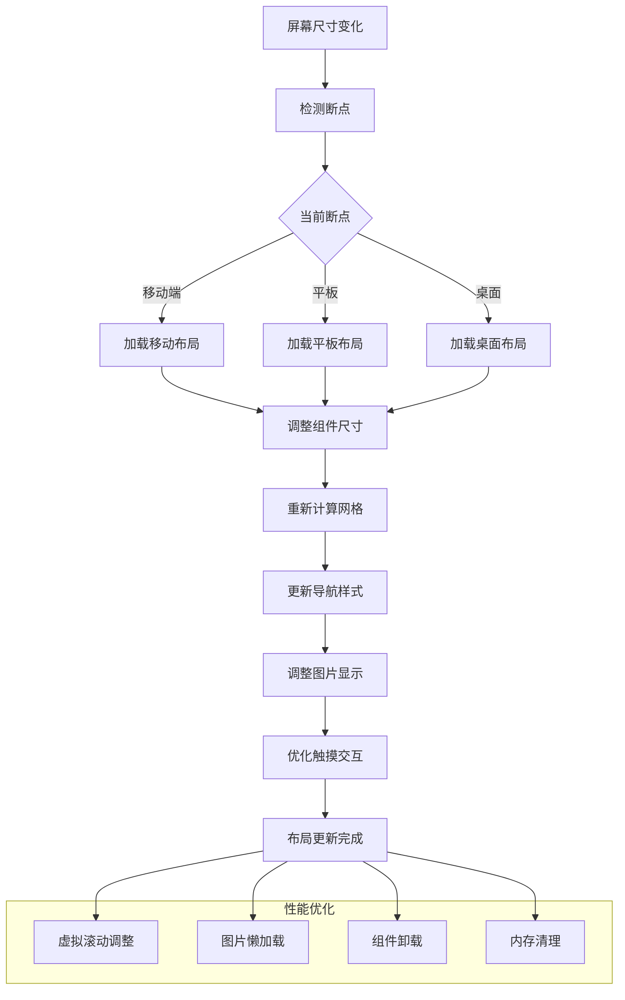
```mermaid
flowchart TD
    A[屏幕尺寸变化] --> B[检测断点]
    B --> C{当前断点}
    
    C -->|移动端| D[加载移动布局]
    C -->|平板| E[加载平板布局]
    C -->|桌面| F[加载桌面布局]
    
    D --> G[调整组件尺寸]
    E --> G
    F --> G
    
    G --> H[重新计算网格]
    H --> I[更新导航样式]
    I --> J[调整图片显示]
    J --> K[优化触摸交互]
    K --> L[布局更新完成]
    
    subgraph "性能优化"
        M[虚拟滚动调整]
        N[图片懒加载]
        O[组件卸载]
        P[内存清理]
    end
    
    L --> M
    L --> N
    L --> O
    L --> P
```

### 🌐 离线模式流程

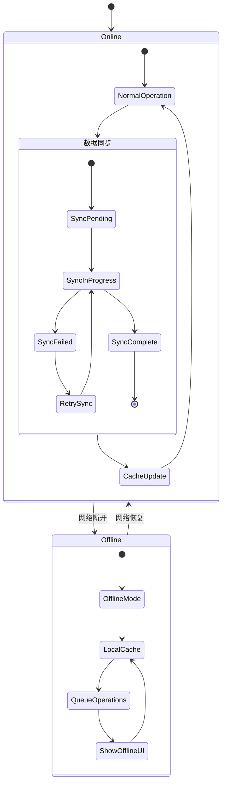
```mermaid
stateDiagram-v2
    [*] --> Online
    
    Online --> Offline : 网络断开
    Offline --> Online : 网络恢复
    
    state Online {
        [*] --> NormalOperation
        NormalOperation --> DataSync
        DataSync --> CacheUpdate
        CacheUpdate --> NormalOperation
    }
    
    state Offline {
        [*] --> OfflineMode
        OfflineMode --> LocalCache
        LocalCache --> QueueOperations
        QueueOperations --> ShowOfflineUI
        ShowOfflineUI --> LocalCache
    }
    
    state "数据同步" as DataSync {
        [*] --> SyncPending
        SyncPending --> SyncInProgress
        SyncInProgress --> SyncComplete
        SyncInProgress --> SyncFailed
        SyncFailed --> RetrySync
        RetrySync --> SyncInProgress
        SyncComplete --> [*]
    }
```

---

## 错误处理流程

### ⚠️ 错误处理时序图

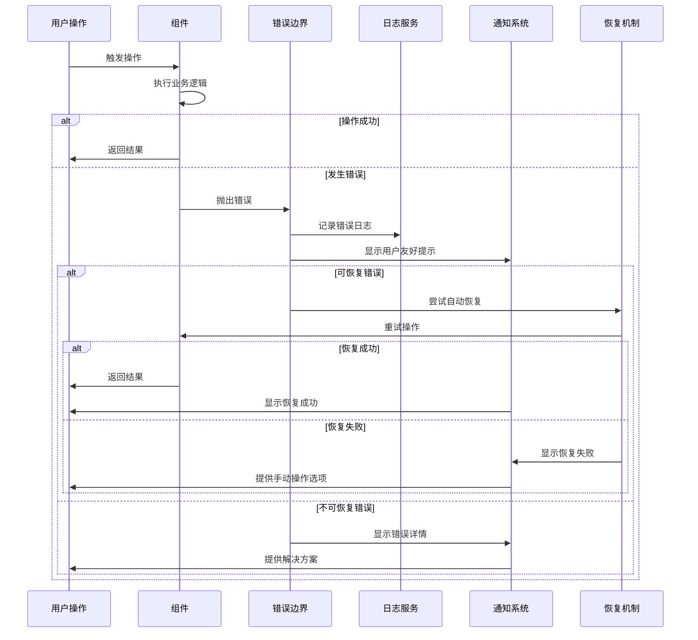
```mermaid
sequenceDiagram
    participant U as 用户操作
    participant C as 组件
    participant E as 错误边界
    participant L as 日志服务
    participant N as 通知系统
    participant R as 恢复机制
    
    U->>C: 触发操作
    C->>C: 执行业务逻辑
    
    alt 操作成功
        C->>U: 返回结果
    else 发生错误
        C->>E: 抛出错误
        E->>L: 记录错误日志
        E->>N: 显示用户友好提示
        
        alt 可恢复错误
            E->>R: 尝试自动恢复
            R->>C: 重试操作
            
            alt 恢复成功
                C->>U: 返回结果
                N->>U: 显示恢复成功
            else 恢复失败
                R->>N: 显示恢复失败
                N->>U: 提供手动操作选项
            end
        else 不可恢复错误
            E->>N: 显示错误详情
            N->>U: 提供解决方案
        end
    end
```

### 🔄 重试机制流程

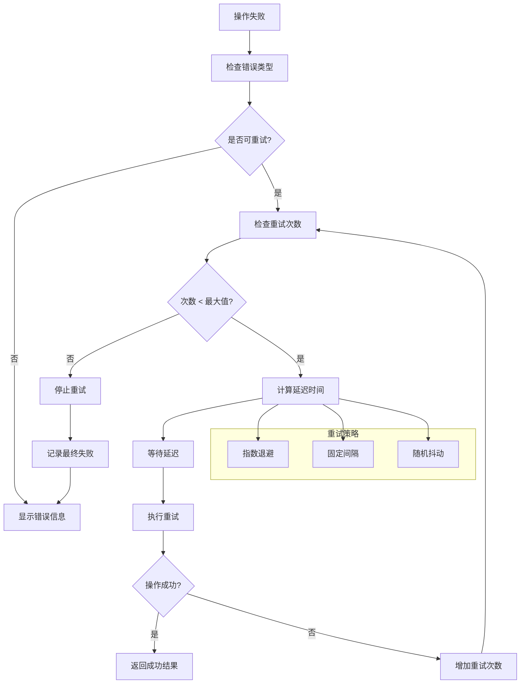
```mermaid
flowchart TD
    A[操作失败] --> B[检查错误类型]
    B --> C{是否可重试?}
    
    C -->|否| D[显示错误信息]
    C -->|是| E[检查重试次数]
    
    E --> F{次数 < 最大值?}
    F -->|否| G[停止重试]
    F -->|是| H[计算延迟时间]
    
    H --> I[等待延迟]
    I --> J[执行重试]
    J --> K{操作成功?}
    
    K -->|是| L[返回成功结果]
    K -->|否| M[增加重试次数]
    M --> E
    
    G --> N[记录最终失败]
    N --> D
    
    subgraph "重试策略"
        O[指数退避]
        P[固定间隔]
        Q[随机抖动]
    end
    
    H --> O
    H --> P
    H --> Q
```

### 🛡️ 错误边界处理

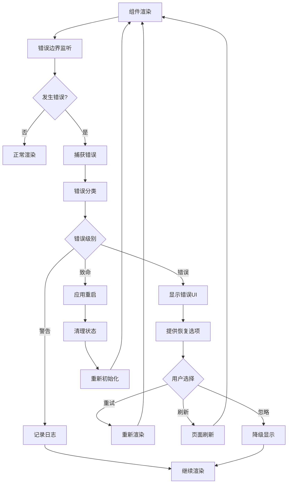
```mermaid
flowchart TD
    A[组件渲染] --> B[错误边界监听]
    B --> C{发生错误?}
    
    C -->|否| D[正常渲染]
    C -->|是| E[捕获错误]
    
    E --> F[错误分类]
    F --> G{错误级别}
    
    G -->|警告| H[记录日志]
    G -->|错误| I[显示错误UI]
    G -->|致命| J[应用重启]
    
    H --> K[继续渲染]
    I --> L[提供恢复选项]
    J --> M[清理状态]
    
    L --> N{用户选择}
    N -->|重试| O[重新渲染]
    N -->|刷新| P[页面刷新]
    N -->|忽略| Q[降级显示]
    
    O --> A
    P --> A
    Q --> K
    
    M --> R[重新初始化]
    R --> A
```

---

## 性能优化流程

### ⚡ 图片加载优化

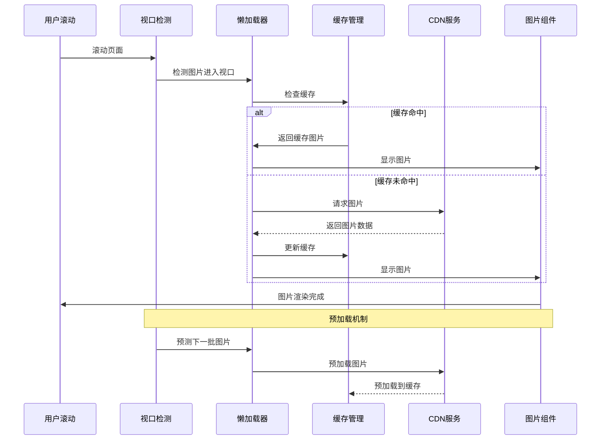
```mermaid
sequenceDiagram
    participant U as 用户滚动
    participant V as 视口检测
    participant L as 懒加载器
    participant C as 缓存管理
    participant CDN as CDN服务
    participant I as 图片组件
    
    U->>V: 滚动页面
    V->>L: 检测图片进入视口
    L->>C: 检查缓存
    
    alt 缓存命中
        C->>L: 返回缓存图片
        L->>I: 显示图片
    else 缓存未命中
        L->>CDN: 请求图片
        CDN-->>L: 返回图片数据
        L->>C: 更新缓存
        L->>I: 显示图片
    end
    
    I->>U: 图片渲染完成
    
    Note over V,I: 预加载机制
    
    V->>L: 预测下一批图片
    L->>CDN: 预加载图片
    CDN-->>C: 预加载到缓存
```

### 🔄 无限滚动优化

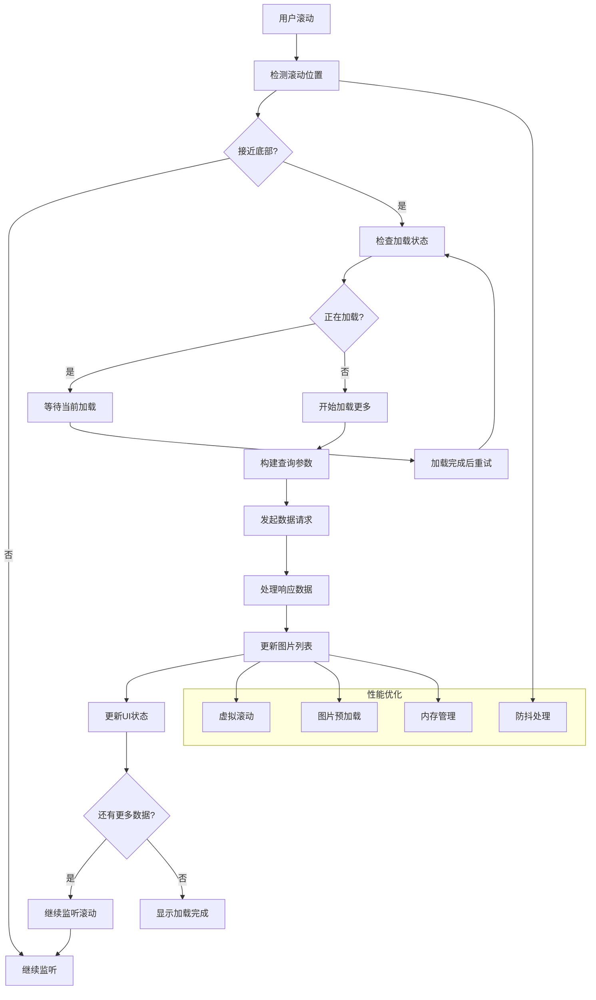
```mermaid
flowchart TD
    A[用户滚动] --> B[检测滚动位置]
    B --> C{接近底部?}
    
    C -->|否| D[继续监听]
    C -->|是| E[检查加载状态]
    
    E --> F{正在加载?}
    F -->|是| G[等待当前加载]
    F -->|否| H[开始加载更多]
    
    H --> I[构建查询参数]
    I --> J[发起数据请求]
    J --> K[处理响应数据]
    K --> L[更新图片列表]
    L --> M[更新UI状态]
    
    M --> N{还有更多数据?}
    N -->|是| O[继续监听滚动]
    N -->|否| P[显示加载完成]
    
    G --> Q[加载完成后重试]
    Q --> E
    
    O --> D
    
    subgraph "性能优化"
        R[虚拟滚动]
        S[图片预加载]
        T[内存管理]
        U[防抖处理]
    end
    
    B --> U
    L --> R
    L --> S
    L --> T
```

### 💾 缓存策略流程

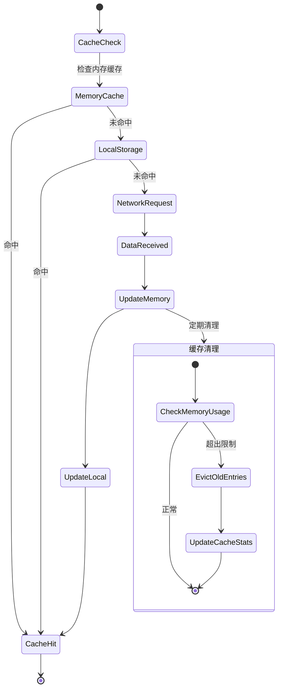
```mermaid
stateDiagram-v2
    [*] --> CacheCheck
    
    CacheCheck --> MemoryCache : 检查内存缓存
    MemoryCache --> CacheHit : 命中
    MemoryCache --> LocalStorage : 未命中
    
    LocalStorage --> CacheHit : 命中
    LocalStorage --> NetworkRequest : 未命中
    
    NetworkRequest --> DataReceived
    DataReceived --> UpdateMemory
    UpdateMemory --> UpdateLocal
    UpdateLocal --> CacheHit
    
    CacheHit --> [*]
    
    state "缓存清理" as CacheCleanup {
        [*] --> CheckMemoryUsage
        CheckMemoryUsage --> EvictOldEntries : 超出限制
        CheckMemoryUsage --> [*] : 正常
        EvictOldEntries --> UpdateCacheStats
        UpdateCacheStats --> [*]
    }
    
    UpdateMemory --> CacheCleanup : 定期清理
```

---

## 数据同步机制

### 🔄 实时数据同步

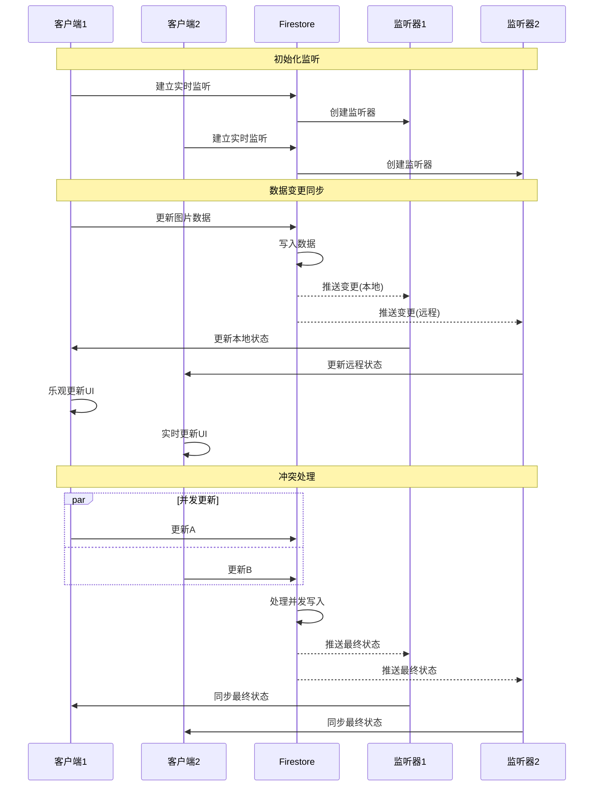
```mermaid
sequenceDiagram
    participant C1 as 客户端1
    participant C2 as 客户端2
    participant F as Firestore
    participant L1 as 监听器1
    participant L2 as 监听器2
    
    Note over C1,L2: 初始化监听
    
    C1->>F: 建立实时监听
    F->>L1: 创建监听器
    C2->>F: 建立实时监听
    F->>L2: 创建监听器
    
    Note over C1,L2: 数据变更同步
    
    C1->>F: 更新图片数据
    F->>F: 写入数据
    F-->>L1: 推送变更(本地)
    F-->>L2: 推送变更(远程)
    
    L1->>C1: 更新本地状态
    L2->>C2: 更新远程状态
    
    C1->>C1: 乐观更新UI
    C2->>C2: 实时更新UI
    
    Note over C1,L2: 冲突处理
    
    par 并发更新
        C1->>F: 更新A
    and
        C2->>F: 更新B
    end
    
    F->>F: 处理并发写入
    F-->>L1: 推送最终状态
    F-->>L2: 推送最终状态
    
    L1->>C1: 同步最终状态
    L2->>C2: 同步最终状态
```

### 📊 数据一致性保证

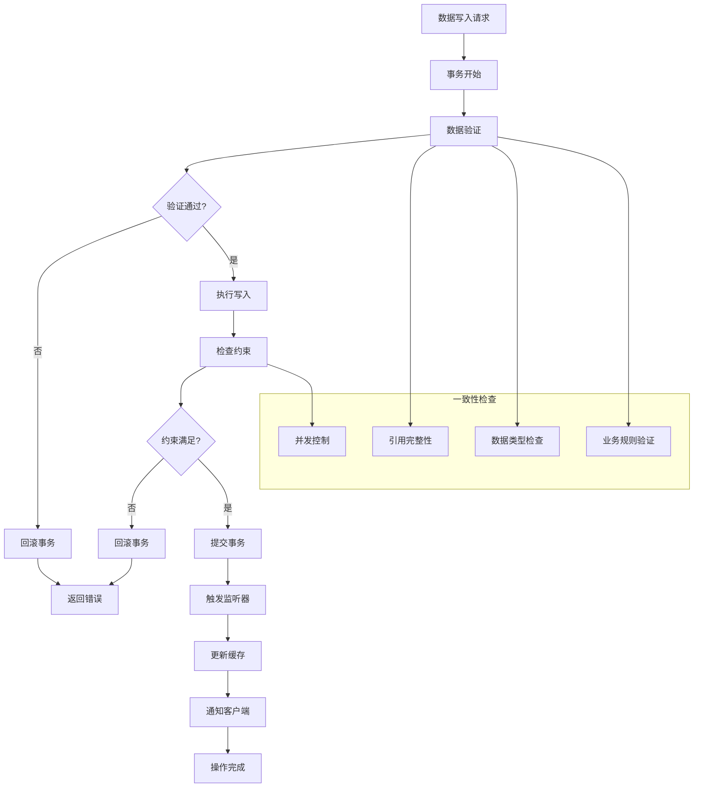
```mermaid
flowchart TD
    A[数据写入请求] --> B[事务开始]
    B --> C[数据验证]
    C --> D{验证通过?}
    
    D -->|否| E[回滚事务]
    D -->|是| F[执行写入]
    
    F --> G[检查约束]
    G --> H{约束满足?}
    
    H -->|否| I[回滚事务]
    H -->|是| J[提交事务]
    
    J --> K[触发监听器]
    K --> L[更新缓存]
    L --> M[通知客户端]
    
    E --> N[返回错误]
    I --> N
    M --> O[操作完成]
    
    subgraph "一致性检查"
        P[引用完整性]
        Q[数据类型检查]
        R[业务规则验证]
        S[并发控制]
    end
    
    C --> P
    C --> Q
    C --> R
    G --> S
```

### 🔄 离线数据同步

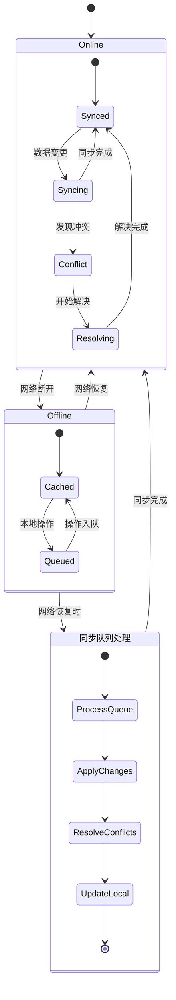
```mermaid
stateDiagram-v2
    [*] --> Online
    
    state Online {
        [*] --> Synced
        Synced --> Syncing : 数据变更
        Syncing --> Synced : 同步完成
        Syncing --> Conflict : 发现冲突
        Conflict --> Resolving : 开始解决
        Resolving --> Synced : 解决完成
    }
    
    state Offline {
        [*] --> Cached
        Cached --> Queued : 本地操作
        Queued --> Cached : 操作入队
    }
    
    Online --> Offline : 网络断开
    Offline --> Online : 网络恢复
    
    state "同步队列处理" as QueueProcessing {
        [*] --> ProcessQueue
        ProcessQueue --> ApplyChanges
        ApplyChanges --> ResolveConflicts
        ResolveConflicts --> UpdateLocal
        UpdateLocal --> [*]
    }
    
    Offline --> QueueProcessing : 网络恢复时
    QueueProcessing --> Online : 同步完成
```

---

## 监控和分析流程

### 📈 性能监控流程

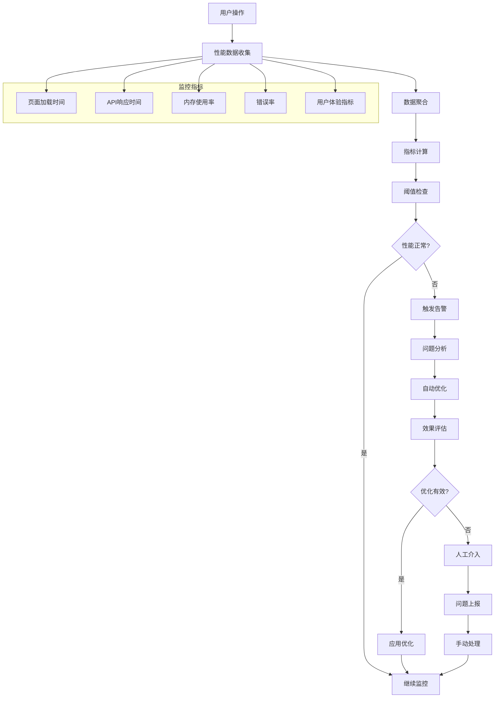
```mermaid
flowchart TD
    A[用户操作] --> B[性能数据收集]
    B --> C[数据聚合]
    C --> D[指标计算]
    D --> E[阈值检查]
    E --> F{性能正常?}
    
    F -->|是| G[继续监控]
    F -->|否| H[触发告警]
    
    H --> I[问题分析]
    I --> J[自动优化]
    J --> K[效果评估]
    K --> L{优化有效?}
    
    L -->|是| M[应用优化]
    L -->|否| N[人工介入]
    
    M --> G
    N --> O[问题上报]
    O --> P[手动处理]
    P --> G
    
    subgraph "监控指标"
        Q[页面加载时间]
        R[API响应时间]
        S[内存使用率]
        T[错误率]
        U[用户体验指标]
    end
    
    B --> Q
    B --> R
    B --> S
    B --> T
    B --> U
```

### 📊 用户行为分析

```mermaid
sequenceDiagram
    participant U as 用户
    participant T as 埋点系统
    participant A as 分析引擎
    participant D as 数据仓库
    participant R as 报告系统
    
    U->>T: 执行操作
    T->>T: 记录事件
    T->>A: 发送事件数据
    
    A->>A: 数据清洗
    A->>A: 事件聚合
    A->>D: 存储处理结果
    
    Note over A,D: 实时分析
    
    A->>R: 更新实时指标
    R->>R: 生成可视化图表
    
    Note over A,D: 批量分析
    
    A->>D: 定期批量处理
    D->>A: 返回历史数据
    A->>A: 趋势分析
    A->>R: 生成分析报告
    
    R->>U: 展示分析结果
```

---

## 总结

### 🎯 流程设计原则

1. **用户体验优先**: 所有流程都以提升用户体验为目标
2. **性能优化**: 在每个环节都考虑性能优化
3. **错误处理**: 完善的错误处理和恢复机制
4. **数据一致性**: 保证数据的一致性和完整性
5. **可扩展性**: 流程设计支持系统扩展

### 🔄 持续优化

- 定期分析用户行为数据
- 监控系统性能指标
- 优化关键路径流程
- 改进错误处理机制
- 提升数据同步效率

### 📋 维护清单

- [ ] 定期更新流程图
- [ ] 监控关键指标
- [ ] 优化瓶颈环节
- [ ] 完善错误处理
- [ ] 提升用户体验

---

**文档维护者**: 系统架构师  
**文档版本**: v1.0  
**最后更新**: 2024-01-01  

*本文档将随着系统功能的演进持续更新和完善。*