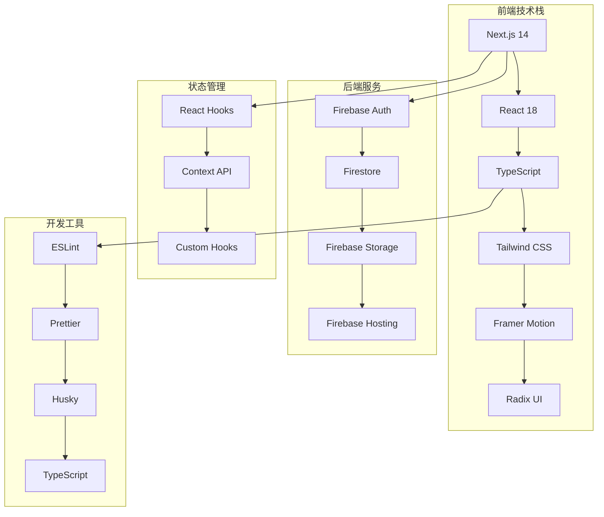
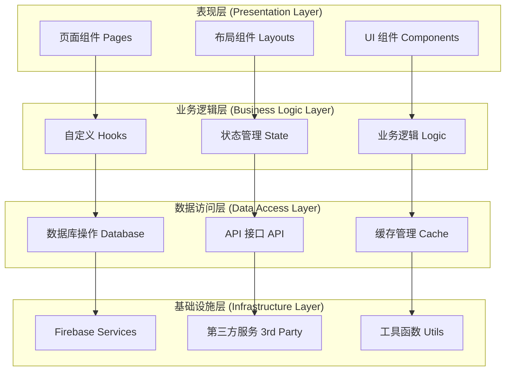
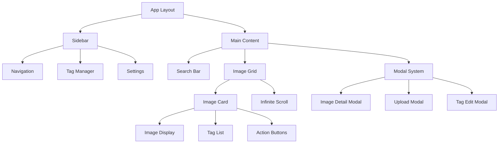
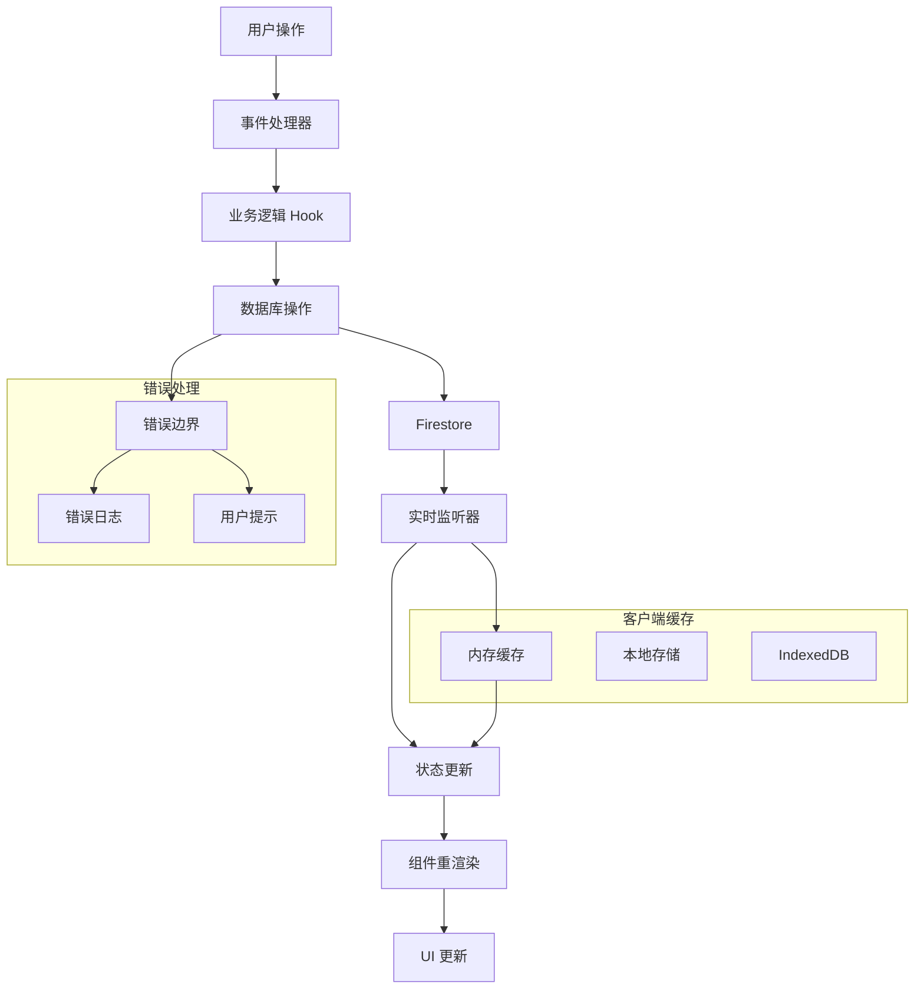

# Gooodcase 架构设计文档

## 📋 目录

1. [系统概述](#系统概述)
2. [技术架构](#技术架构)
3. [模块设计](#模块设计)
4. [组件架构](#组件架构)
5. [数据流架构](#数据流架构)
6. [状态管理](#状态管理)
7. [路由设计](#路由设计)
8. [性能架构](#性能架构)
9. [安全架构](#安全架构)
10. [部署架构](#部署架构)

---

## 系统概述

### 🎯 项目定位

**Gooodcase** 是一个现代化的图片管理和展示平台，专注于为用户提供高效的图片组织、标签管理和智能搜索功能。

### 🏗️ 架构原则

1. **模块化设计**: 高内聚、低耦合的模块划分
2. **组件化开发**: 可复用的 React 组件体系
3. **响应式架构**: 适配多种设备和屏幕尺寸
4. **性能优先**: 优化加载速度和用户体验
5. **可扩展性**: 支持功能扩展和业务增长
6. **类型安全**: 全面的 TypeScript 类型定义

### 📊 系统特性

- ✅ **实时数据同步**: Firebase Firestore 实时监听
- ✅ **离线支持**: PWA 特性和本地缓存
- ✅ **响应式设计**: 移动端和桌面端适配
- ✅ **无限滚动**: 高性能的图片列表加载
- ✅ **智能搜索**: 多维度搜索和过滤
- ✅ **批量操作**: 高效的批量管理功能
- ✅ **主题切换**: 深色/浅色主题支持

---

## 技术架构

### 🛠️ 技术栈概览



### 🏛️ 分层架构



### 🔧 核心技术选型

| 技术领域 | 选型 | 版本 | 选择理由 |
|---------|------|------|----------|
| **前端框架** | Next.js | 14.x | SSR/SSG 支持，优秀的性能优化 |
| **UI 库** | React | 18.x | 成熟的组件化开发体验 |
| **类型系统** | TypeScript | 5.x | 类型安全，提升开发效率 |
| **样式方案** | Tailwind CSS | 3.x | 原子化 CSS，快速开发 |
| **动画库** | Framer Motion | 10.x | 声明式动画，性能优秀 |
| **组件库** | Radix UI | 1.x | 无样式组件，可访问性好 |
| **数据库** | Firestore | 9.x | 实时同步，NoSQL 灵活性 |
| **存储** | Firebase Storage | 9.x | 文件存储，CDN 加速 |
| **部署** | Vercel | - | 零配置部署，边缘计算 |

---

## 模块设计

### 📦 模块划分

```
src/
├── app/                    # Next.js App Router
│   ├── globals.css        # 全局样式
│   ├── layout.tsx         # 根布局
│   ├── page.tsx           # 首页
│   └── api/               # API 路由
├── components/            # 组件模块
│   ├── ui/               # 基础 UI 组件
│   ├── business/         # 业务组件
│   └── layout/           # 布局组件
├── hooks/                # 自定义 Hooks
├── lib/                  # 工具库
│   ├── database.ts       # 数据库操作
│   ├── firebase.ts       # Firebase 配置
│   └── utils.ts          # 工具函数
├── types/                # 类型定义
└── constants/            # 常量定义
```

### 🧩 核心模块详解

#### 1. 页面模块 (Pages)

```typescript
// app/page.tsx - 主页面
export default function HomePage() {
  const {
    // 状态
    images, tags, tagGroups, isLoading,
    // 操作
    handleImageUpload, handleTagCreate, handleSearch,
    // UI 状态
    selectedImages, editMode, modalState
  } = useHomePage();
  
  return (
    <div className="min-h-screen bg-background">
      <AppSidebar />
      <main className="pl-64">
        <SearchBar onSearch={handleSearch} />
        <ImageGrid 
          images={images}
          selectedImages={selectedImages}
          editMode={editMode}
        />
      </main>
    </div>
  );
}
```

#### 2. 组件模块 (Components)

##### 基础 UI 组件
```typescript
// components/ui/button.tsx
interface ButtonProps {
  variant: 'default' | 'destructive' | 'outline' | 'secondary' | 'ghost' | 'link';
  size: 'default' | 'sm' | 'lg' | 'icon';
  children: React.ReactNode;
}

export const Button = ({ variant, size, children, ...props }: ButtonProps) => {
  return (
    <button
      className={cn(buttonVariants({ variant, size }))}
      {...props}
    >
      {children}
    </button>
  );
};
```

##### 业务组件
```typescript
// components/image-card.tsx
interface ImageCardProps {
  image: ImageData;
  selected: boolean;
  editMode: boolean;
  onSelect: (id: string) => void;
  onEdit: (image: ImageData) => void;
}

export const ImageCard = ({ image, selected, editMode, onSelect, onEdit }: ImageCardProps) => {
  return (
    <motion.div
      layout
      initial={{ opacity: 0, scale: 0.8 }}
      animate={{ opacity: 1, scale: 1 }}
      className={cn(
        "relative group cursor-pointer rounded-lg overflow-hidden",
        selected && "ring-2 ring-primary"
      )}
    >
      <Image
        src={image.url}
        alt={image.title}
        width={image.width}
        height={image.height}
        className="w-full h-auto"
      />
      {editMode && (
        <div className="absolute inset-0 bg-black/50 flex items-center justify-center">
          <Checkbox checked={selected} onCheckedChange={() => onSelect(image.id)} />
        </div>
      )}
    </motion.div>
  );
};
```

#### 3. Hooks 模块

```typescript
// hooks/use-image-state.ts
export const useImageState = () => {
  const [images, setImages] = useState<ImageData[]>([]);
  const [loading, setLoading] = useState(true);
  const [error, setError] = useState<string | null>(null);
  
  // 实时监听图片数据
  useEffect(() => {
    const unsubscribe = database.subscribeToImages(
      (newImages) => {
        setImages(newImages);
        setLoading(false);
      },
      (error) => {
        setError(error.message);
        setLoading(false);
      }
    );
    
    return unsubscribe;
  }, []);
  
  return { images, loading, error, setImages };
};
```

#### 4. 数据访问模块

```typescript
// lib/database.ts
export class Database {
  private db: Firestore;
  
  constructor() {
    this.db = getFirestore();
  }
  
  // 实时监听图片数据
  subscribeToImages(
    onSuccess: (images: ImageData[]) => void,
    onError: (error: Error) => void
  ): Unsubscribe {
    const q = query(
      collection(this.db, 'images'),
      orderBy('createdAt', 'desc')
    );
    
    return onSnapshot(q, 
      (snapshot) => {
        const images = snapshot.docs.map(doc => ({
          id: doc.id,
          ...doc.data()
        })) as ImageData[];
        onSuccess(images);
      },
      onError
    );
  }
  
  // 添加图片
  async addImage(imageData: Omit<ImageData, 'id'>): Promise<string> {
    const docRef = await addDoc(collection(this.db, 'images'), {
      ...imageData,
      createdAt: serverTimestamp(),
      updatedAt: serverTimestamp()
    });
    return docRef.id;
  }
}
```

---

## 组件架构

### 🏗️ 组件层次结构



### 🎨 组件设计模式

#### 1. 复合组件模式 (Compound Components)

```typescript
// components/tag-manager/index.tsx
interface TagManagerProps {
  children: React.ReactNode;
}

const TagManager = ({ children }: TagManagerProps) => {
  const [selectedTags, setSelectedTags] = useState<string[]>([]);
  
  return (
    <TagManagerContext.Provider value={{ selectedTags, setSelectedTags }}>
      <div className="tag-manager">
        {children}
      </div>
    </TagManagerContext.Provider>
  );
};

// 子组件
TagManager.Header = TagManagerHeader;
TagManager.List = TagManagerList;
TagManager.Item = TagManagerItem;
TagManager.Actions = TagManagerActions;

// 使用方式
<TagManager>
  <TagManager.Header title="标签管理" />
  <TagManager.List>
    {tags.map(tag => (
      <TagManager.Item key={tag.id} tag={tag} />
    ))}
  </TagManager.List>
  <TagManager.Actions />
</TagManager>
```

#### 2. 渲染属性模式 (Render Props)

```typescript
// components/infinite-scroll.tsx
interface InfiniteScrollProps<T> {
  items: T[];
  loadMore: () => Promise<void>;
  hasMore: boolean;
  loading: boolean;
  children: (item: T, index: number) => React.ReactNode;
}

export const InfiniteScroll = <T,>({
  items,
  loadMore,
  hasMore,
  loading,
  children
}: InfiniteScrollProps<T>) => {
  const { ref, inView } = useInView();
  
  useEffect(() => {
    if (inView && hasMore && !loading) {
      loadMore();
    }
  }, [inView, hasMore, loading, loadMore]);
  
  return (
    <div className="grid grid-cols-1 md:grid-cols-2 lg:grid-cols-3 xl:grid-cols-4 gap-4">
      {items.map((item, index) => children(item, index))}
      {hasMore && (
        <div ref={ref} className="col-span-full flex justify-center p-4">
          {loading && <Spinner />}
        </div>
      )}
    </div>
  );
};

// 使用方式
<InfiniteScroll
  items={images}
  loadMore={loadMoreImages}
  hasMore={hasMoreImages}
  loading={loading}
>
  {(image, index) => (
    <ImageCard
      key={image.id}
      image={image}
      selected={selectedImages.includes(image.id)}
      onSelect={handleImageSelect}
    />
  )}
</InfiniteScroll>
```

#### 3. 高阶组件模式 (HOC)

```typescript
// hoc/with-loading.tsx
interface WithLoadingProps {
  loading: boolean;
}

export const withLoading = <P extends object>(
  Component: React.ComponentType<P>
) => {
  return (props: P & WithLoadingProps) => {
    const { loading, ...restProps } = props;
    
    if (loading) {
      return (
        <div className="flex items-center justify-center p-8">
          <Spinner size="lg" />
        </div>
      );
    }
    
    return <Component {...(restProps as P)} />;
  };
};

// 使用方式
const ImageGridWithLoading = withLoading(ImageGrid);

<ImageGridWithLoading
  images={images}
  loading={loading}
  onImageSelect={handleImageSelect}
/>
```

### 🔄 组件通信模式

#### 1. Props 传递
```typescript
// 父组件向子组件传递数据
<ImageCard
  image={image}
  selected={selected}
  onSelect={onSelect}
  onEdit={onEdit}
/>
```

#### 2. Context 共享状态
```typescript
// contexts/app-context.tsx
interface AppContextType {
  theme: 'light' | 'dark';
  setTheme: (theme: 'light' | 'dark') => void;
  user: User | null;
  setUser: (user: User | null) => void;
}

export const AppContext = createContext<AppContextType | undefined>(undefined);

export const useAppContext = () => {
  const context = useContext(AppContext);
  if (!context) {
    throw new Error('useAppContext must be used within AppProvider');
  }
  return context;
};
```

#### 3. 事件总线
```typescript
// lib/event-bus.ts
class EventBus {
  private events: Map<string, Function[]> = new Map();
  
  on(event: string, callback: Function) {
    if (!this.events.has(event)) {
      this.events.set(event, []);
    }
    this.events.get(event)!.push(callback);
  }
  
  emit(event: string, data?: any) {
    const callbacks = this.events.get(event);
    if (callbacks) {
      callbacks.forEach(callback => callback(data));
    }
  }
  
  off(event: string, callback: Function) {
    const callbacks = this.events.get(event);
    if (callbacks) {
      const index = callbacks.indexOf(callback);
      if (index > -1) {
        callbacks.splice(index, 1);
      }
    }
  }
}

export const eventBus = new EventBus();
```

---

## 数据流架构

### 🌊 数据流向图



### 📊 状态管理架构

#### 1. 全局状态结构

```typescript
// types/app-state.ts
interface AppState {
  // 数据状态
  images: ImageData[];
  tags: Tag[];
  tagGroups: TagGroup[];
  
  // UI 状态
  selectedImages: string[];
  editMode: boolean;
  searchQuery: string;
  searchFilters: SearchFilters;
  
  // 模态框状态
  modals: {
    imageDetail: { open: boolean; imageId?: string };
    upload: { open: boolean };
    tagEdit: { open: boolean; tagId?: string };
  };
  
  // 加载状态
  loading: {
    images: boolean;
    tags: boolean;
    upload: boolean;
  };
  
  // 错误状态
  errors: {
    images?: string;
    tags?: string;
    upload?: string;
  };
  
  // 缓存状态
  cache: {
    lastFetch: Record<string, number>;
    invalidated: string[];
  };
  
  // 性能指标
  performance: {
    loadTime: number;
    renderTime: number;
    cacheHitRate: number;
  };
}
```

#### 2. 状态更新模式

```typescript
// hooks/use-app-state.ts
export const useAppState = () => {
  const [state, setState] = useState<AppState>(initialState);
  
  // 状态更新函数
  const updateState = useCallback((updates: Partial<AppState>) => {
    setState(prev => ({ ...prev, ...updates }));
  }, []);
  
  // 批量状态更新
  const batchUpdate = useCallback((updates: Array<Partial<AppState>>) => {
    setState(prev => {
      return updates.reduce((acc, update) => ({ ...acc, ...update }), prev);
    });
  }, []);
  
  // 重置状态
  const resetState = useCallback(() => {
    setState(initialState);
  }, []);
  
  return {
    state,
    updateState,
    batchUpdate,
    resetState
  };
};
```

#### 3. 数据同步策略

```typescript
// hooks/use-data-sync.ts
export const useDataSync = () => {
  const { state, updateState } = useAppState();
  const [syncStatus, setSyncStatus] = useState<'idle' | 'syncing' | 'error'>('idle');
  
  // 实时数据同步
  useEffect(() => {
    setSyncStatus('syncing');
    
    const unsubscribeImages = database.subscribeToImages(
      (images) => {
        updateState({ 
          images,
          loading: { ...state.loading, images: false }
        });
        setSyncStatus('idle');
      },
      (error) => {
        updateState({
          errors: { ...state.errors, images: error.message },
          loading: { ...state.loading, images: false }
        });
        setSyncStatus('error');
      }
    );
    
    const unsubscribeTags = database.subscribeToTags(
      (tags) => {
        updateState({ 
          tags,
          loading: { ...state.loading, tags: false }
        });
      },
      (error) => {
        updateState({
          errors: { ...state.errors, tags: error.message },
          loading: { ...state.loading, tags: false }
        });
      }
    );
    
    return () => {
      unsubscribeImages();
      unsubscribeTags();
    };
  }, []);
  
  return { syncStatus };
};
```

---

## 路由设计

### 🛣️ 路由架构

```typescript
// Next.js App Router 结构
app/
├── layout.tsx              # 根布局
├── page.tsx               # 首页 (/)
├── loading.tsx            # 加载页面
├── error.tsx              # 错误页面
├── not-found.tsx          # 404 页面
├── api/                   # API 路由
│   ├── images/
│   │   ├── route.ts       # GET /api/images
│   │   └── [id]/
│   │       └── route.ts   # GET/PUT/DELETE /api/images/[id]
│   ├── tags/
│   │   └── route.ts       # GET/POST /api/tags
│   └── upload/
│       └── route.ts       # POST /api/upload
└── (dashboard)/           # 路由组
    ├── layout.tsx         # 仪表板布局
    ├── images/
    │   ├── page.tsx       # /images
    │   └── [id]/
    │       └── page.tsx   # /images/[id]
    ├── tags/
    │   └── page.tsx       # /tags
    └── settings/
        └── page.tsx       # /settings
```

### 🔗 路由配置

```typescript
// lib/routes.ts
export const routes = {
  home: '/',
  images: {
    list: '/images',
    detail: (id: string) => `/images/${id}`,
    edit: (id: string) => `/images/${id}/edit`
  },
  tags: {
    list: '/tags',
    detail: (id: string) => `/tags/${id}`
  },
  settings: '/settings',
  api: {
    images: '/api/images',
    tags: '/api/tags',
    upload: '/api/upload'
  }
} as const;

// 路由守卫
export const withAuth = (Component: React.ComponentType) => {
  return function AuthenticatedComponent(props: any) {
    const { user, loading } = useAuth();
    
    if (loading) {
      return <LoadingSpinner />;
    }
    
    if (!user) {
      redirect('/login');
    }
    
    return <Component {...props} />;
  };
};
```

### 📱 导航管理

```typescript
// hooks/use-navigation.ts
export const useNavigation = () => {
  const router = useRouter();
  const pathname = usePathname();
  const searchParams = useSearchParams();
  
  // 导航到指定页面
  const navigateTo = useCallback((path: string, options?: { replace?: boolean }) => {
    if (options?.replace) {
      router.replace(path);
    } else {
      router.push(path);
    }
  }, [router]);
  
  // 返回上一页
  const goBack = useCallback(() => {
    router.back();
  }, [router]);
  
  // 更新查询参数
  const updateSearchParams = useCallback((params: Record<string, string>) => {
    const newSearchParams = new URLSearchParams(searchParams);
    
    Object.entries(params).forEach(([key, value]) => {
      if (value) {
        newSearchParams.set(key, value);
      } else {
        newSearchParams.delete(key);
      }
    });
    
    router.push(`${pathname}?${newSearchParams.toString()}`);
  }, [pathname, searchParams, router]);
  
  return {
    pathname,
    searchParams,
    navigateTo,
    goBack,
    updateSearchParams
  };
};
```

---

## 性能架构

### ⚡ 性能优化策略

#### 1. 代码分割

```typescript
// 动态导入组件
const ImageDetailModal = dynamic(() => import('./image-detail-modal'), {
  loading: () => <ModalSkeleton />,
  ssr: false
});

const TagManager = dynamic(() => import('./tag-manager'), {
  loading: () => <div>加载中...</div>
});

// 路由级别的代码分割
const SettingsPage = dynamic(() => import('./settings/page'), {
  loading: () => <PageSkeleton />
});
```

#### 2. 图片优化

```typescript
// components/optimized-image.tsx
interface OptimizedImageProps {
  src: string;
  alt: string;
  width: number;
  height: number;
  priority?: boolean;
  placeholder?: 'blur' | 'empty';
}

export const OptimizedImage = ({
  src,
  alt,
  width,
  height,
  priority = false,
  placeholder = 'blur'
}: OptimizedImageProps) => {
  const [isLoading, setIsLoading] = useState(true);
  const [error, setError] = useState(false);
  
  return (
    <div className="relative overflow-hidden">
      {isLoading && (
        <div className="absolute inset-0 bg-gray-200 animate-pulse" />
      )}
      <Image
        src={src}
        alt={alt}
        width={width}
        height={height}
        priority={priority}
        placeholder={placeholder}
        className={cn(
          "transition-opacity duration-300",
          isLoading ? "opacity-0" : "opacity-100"
        )}
        onLoad={() => setIsLoading(false)}
        onError={() => setError(true)}
      />
      {error && (
        <div className="absolute inset-0 flex items-center justify-center bg-gray-100">
          <ImageIcon className="w-8 h-8 text-gray-400" />
        </div>
      )}
    </div>
  );
};
```

#### 3. 虚拟滚动

```typescript
// components/virtual-grid.tsx
interface VirtualGridProps<T> {
  items: T[];
  itemHeight: number;
  containerHeight: number;
  renderItem: (item: T, index: number) => React.ReactNode;
}

export const VirtualGrid = <T,>({
  items,
  itemHeight,
  containerHeight,
  renderItem
}: VirtualGridProps<T>) => {
  const [scrollTop, setScrollTop] = useState(0);
  
  const visibleStart = Math.floor(scrollTop / itemHeight);
  const visibleEnd = Math.min(
    visibleStart + Math.ceil(containerHeight / itemHeight) + 1,
    items.length
  );
  
  const visibleItems = items.slice(visibleStart, visibleEnd);
  
  return (
    <div
      className="overflow-auto"
      style={{ height: containerHeight }}
      onScroll={(e) => setScrollTop(e.currentTarget.scrollTop)}
    >
      <div style={{ height: items.length * itemHeight, position: 'relative' }}>
        {visibleItems.map((item, index) => (
          <div
            key={visibleStart + index}
            style={{
              position: 'absolute',
              top: (visibleStart + index) * itemHeight,
              height: itemHeight,
              width: '100%'
            }}
          >
            {renderItem(item, visibleStart + index)}
          </div>
        ))}
      </div>
    </div>
  );
};
```

#### 4. 缓存策略

```typescript
// lib/cache.ts
class CacheManager {
  private memoryCache = new Map<string, { data: any; timestamp: number; ttl: number }>();
  private persistentCache: IDBDatabase | null = null;
  
  constructor() {
    this.initPersistentCache();
  }
  
  // 内存缓存
  setMemoryCache(key: string, data: any, ttl: number = 5 * 60 * 1000) {
    this.memoryCache.set(key, {
      data,
      timestamp: Date.now(),
      ttl
    });
  }
  
  getMemoryCache(key: string) {
    const cached = this.memoryCache.get(key);
    if (!cached) return null;
    
    if (Date.now() - cached.timestamp > cached.ttl) {
      this.memoryCache.delete(key);
      return null;
    }
    
    return cached.data;
  }
  
  // 持久化缓存 (IndexedDB)
  async setPersistentCache(key: string, data: any) {
    if (!this.persistentCache) return;
    
    const transaction = this.persistentCache.transaction(['cache'], 'readwrite');
    const store = transaction.objectStore('cache');
    
    await store.put({
      key,
      data,
      timestamp: Date.now()
    });
  }
  
  async getPersistentCache(key: string) {
    if (!this.persistentCache) return null;
    
    const transaction = this.persistentCache.transaction(['cache'], 'readonly');
    const store = transaction.objectStore('cache');
    const result = await store.get(key);
    
    return result?.data || null;
  }
  
  private async initPersistentCache() {
    return new Promise<void>((resolve, reject) => {
      const request = indexedDB.open('AppCache', 1);
      
      request.onerror = () => reject(request.error);
      request.onsuccess = () => {
        this.persistentCache = request.result;
        resolve();
      };
      
      request.onupgradeneeded = () => {
        const db = request.result;
        if (!db.objectStoreNames.contains('cache')) {
          db.createObjectStore('cache', { keyPath: 'key' });
        }
      };
    });
  }
}

export const cacheManager = new CacheManager();
```

---

## 安全架构

### 🔒 安全策略

#### 1. 输入验证

```typescript
// lib/validation.ts
import { z } from 'zod';

// 图片数据验证
export const imageSchema = z.object({
  url: z.string().url('无效的图片URL'),
  title: z.string().min(1, '标题不能为空').max(100, '标题过长'),
  tags: z.array(z.object({
    id: z.string(),
    name: z.string().min(1, '标签名不能为空'),
    color: z.string().regex(/^#[0-9A-F]{6}$/i, '无效的颜色格式')
  })),
  width: z.number().positive('宽度必须为正数'),
  height: z.number().positive('高度必须为正数')
});

// 文件上传验证
export const fileUploadSchema = z.object({
  file: z.instanceof(File)
    .refine(file => file.size <= 10 * 1024 * 1024, '文件大小不能超过10MB')
    .refine(file => ['image/jpeg', 'image/png', 'image/gif', 'image/webp'].includes(file.type), '不支持的文件格式')
});

// 验证函数
export const validateInput = <T>(schema: z.ZodSchema<T>, data: unknown): { success: boolean; data?: T; errors?: string[] } => {
  try {
    const validatedData = schema.parse(data);
    return { success: true, data: validatedData };
  } catch (error) {
    if (error instanceof z.ZodError) {
      return {
        success: false,
        errors: error.errors.map(err => err.message)
      };
    }
    return { success: false, errors: ['验证失败'] };
  }
};
```

#### 2. XSS 防护

```typescript
// lib/sanitize.ts
import DOMPurify from 'dompurify';

// HTML 内容清理
export const sanitizeHtml = (html: string): string => {
  return DOMPurify.sanitize(html, {
    ALLOWED_TAGS: ['b', 'i', 'em', 'strong', 'u'],
    ALLOWED_ATTR: [],
    KEEP_CONTENT: true
  });
};

// 用户输入清理
export const sanitizeUserInput = (input: string): string => {
  return input
    .trim()
    .replace(/[<>"'&]/g, (char) => {
      const entities: Record<string, string> = {
        '<': '&lt;',
        '>': '&gt;',
        '"': '&quot;',
        "'": '&#x27;',
        '&': '&amp;'
      };
      return entities[char] || char;
    });
};

// 安全的组件
interface SafeHtmlProps {
  html: string;
  className?: string;
}

export const SafeHtml = ({ html, className }: SafeHtmlProps) => {
  const sanitizedHtml = sanitizeHtml(html);
  
  return (
    <div
      className={className}
      dangerouslySetInnerHTML={{ __html: sanitizedHtml }}
    />
  );
};
```

#### 3. CSRF 防护

```typescript
// lib/csrf.ts
export const generateCSRFToken = (): string => {
  return crypto.randomUUID();
};

export const validateCSRFToken = (token: string, sessionToken: string): boolean => {
  return token === sessionToken;
};

// API 路由中的 CSRF 验证
export const withCSRFProtection = (handler: NextApiHandler): NextApiHandler => {
  return async (req, res) => {
    if (req.method !== 'GET') {
      const token = req.headers['x-csrf-token'] as string;
      const sessionToken = req.session?.csrfToken;
      
      if (!token || !sessionToken || !validateCSRFToken(token, sessionToken)) {
        return res.status(403).json({ error: 'Invalid CSRF token' });
      }
    }
    
    return handler(req, res);
  };
};
```

---

## 部署架构

### 🚀 部署策略

#### 1. Vercel 部署配置

```json
// vercel.json
{
  "version": 2,
  "builds": [
    {
      "src": "package.json",
      "use": "@vercel/next"
    }
  ],
  "routes": [
    {
      "src": "/api/(.*)",
      "dest": "/api/$1"
    },
    {
      "src": "/(.*)",
      "dest": "/$1"
    }
  ],
  "env": {
    "NEXT_PUBLIC_FIREBASE_API_KEY": "@firebase-api-key",
    "NEXT_PUBLIC_FIREBASE_AUTH_DOMAIN": "@firebase-auth-domain",
    "NEXT_PUBLIC_FIREBASE_PROJECT_ID": "@firebase-project-id"
  },
  "headers": [
    {
      "source": "/(.*)",
      "headers": [
        {
          "key": "X-Content-Type-Options",
          "value": "nosniff"
        },
        {
          "key": "X-Frame-Options",
          "value": "DENY"
        },
        {
          "key": "X-XSS-Protection",
          "value": "1; mode=block"
        }
      ]
    }
  ]
}
```

#### 2. 环境配置

```typescript
// lib/env.ts
import { z } from 'zod';

const envSchema = z.object({
  NODE_ENV: z.enum(['development', 'production', 'test']),
  NEXT_PUBLIC_FIREBASE_API_KEY: z.string(),
  NEXT_PUBLIC_FIREBASE_AUTH_DOMAIN: z.string(),
  NEXT_PUBLIC_FIREBASE_PROJECT_ID: z.string(),
  NEXT_PUBLIC_FIREBASE_STORAGE_BUCKET: z.string(),
  NEXT_PUBLIC_FIREBASE_MESSAGING_SENDER_ID: z.string(),
  NEXT_PUBLIC_FIREBASE_APP_ID: z.string()
});

export const env = envSchema.parse(process.env);

// 环境检查
export const isDevelopment = env.NODE_ENV === 'development';
export const isProduction = env.NODE_ENV === 'production';
export const isTest = env.NODE_ENV === 'test';
```

#### 3. CI/CD 流程

```yaml
# .github/workflows/deploy.yml
name: Deploy to Vercel

on:
  push:
    branches: [main]
  pull_request:
    branches: [main]

jobs:
  test:
    runs-on: ubuntu-latest
    steps:
      - uses: actions/checkout@v3
      - uses: actions/setup-node@v3
        with:
          node-version: '18'
          cache: 'npm'
      
      - run: npm ci
      - run: npm run lint
      - run: npm run type-check
      - run: npm run test
      - run: npm run build
  
  deploy:
    needs: test
    runs-on: ubuntu-latest
    if: github.ref == 'refs/heads/main'
    steps:
      - uses: actions/checkout@v3
      - uses: amondnet/vercel-action@v20
        with:
          vercel-token: ${{ secrets.VERCEL_TOKEN }}
          vercel-org-id: ${{ secrets.ORG_ID }}
          vercel-project-id: ${{ secrets.PROJECT_ID }}
          vercel-args: '--prod'
```

### 📊 监控和日志

#### 1. 性能监控

```typescript
// lib/analytics.ts
interface PerformanceMetric {
  name: string;
  value: number;
  timestamp: number;
  url: string;
}

class Analytics {
  private metrics: PerformanceMetric[] = [];
  
  // 记录性能指标
  recordMetric(name: string, value: number) {
    const metric: PerformanceMetric = {
      name,
      value,
      timestamp: Date.now(),
      url: window.location.href
    };
    
    this.metrics.push(metric);
    
    // 发送到分析服务
    this.sendToAnalytics(metric);
  }
  
  // 记录页面加载时间
  recordPageLoad() {
    if (typeof window !== 'undefined') {
      window.addEventListener('load', () => {
        const loadTime = performance.now();
        this.recordMetric('page_load_time', loadTime);
      });
    }
  }
  
  // 记录组件渲染时间
  recordComponentRender(componentName: string, renderTime: number) {
    this.recordMetric(`component_render_${componentName}`, renderTime);
  }
  
  private async sendToAnalytics(metric: PerformanceMetric) {
    try {
      await fetch('/api/analytics', {
        method: 'POST',
        headers: { 'Content-Type': 'application/json' },
        body: JSON.stringify(metric)
      });
    } catch (error) {
      console.error('Failed to send analytics:', error);
    }
  }
}

export const analytics = new Analytics();
```

#### 2. 错误监控

```typescript
// lib/error-tracking.ts
interface ErrorInfo {
  message: string;
  stack?: string;
  url: string;
  timestamp: number;
  userAgent: string;
  userId?: string;
}

class ErrorTracker {
  private errors: ErrorInfo[] = [];
  
  constructor() {
    this.setupGlobalErrorHandlers();
  }
  
  // 记录错误
  recordError(error: Error, additionalInfo?: Record<string, any>) {
    const errorInfo: ErrorInfo = {
      message: error.message,
      stack: error.stack,
      url: typeof window !== 'undefined' ? window.location.href : '',
      timestamp: Date.now(),
      userAgent: typeof navigator !== 'undefined' ? navigator.userAgent : '',
      ...additionalInfo
    };
    
    this.errors.push(errorInfo);
    this.sendErrorToService(errorInfo);
  }
  
  // 设置全局错误处理
  private setupGlobalErrorHandlers() {
    if (typeof window !== 'undefined') {
      window.addEventListener('error', (event) => {
        this.recordError(new Error(event.message), {
          filename: event.filename,
          lineno: event.lineno,
          colno: event.colno
        });
      });
      
      window.addEventListener('unhandledrejection', (event) => {
        this.recordError(new Error(`Unhandled Promise Rejection: ${event.reason}`));
      });
    }
  }
  
  private async sendErrorToService(errorInfo: ErrorInfo) {
    try {
      await fetch('/api/errors', {
        method: 'POST',
        headers: { 'Content-Type': 'application/json' },
        body: JSON.stringify(errorInfo)
      });
    } catch (error) {
      console.error('Failed to send error to service:', error);
    }
  }
}

export const errorTracker = new ErrorTracker();
```

---

## 扩展性设计

### 🔮 未来扩展计划

#### 1. 微前端架构

```typescript
// 模块联邦配置 (webpack.config.js)
const ModuleFederationPlugin = require('@module-federation/webpack');

module.exports = {
  plugins: [
    new ModuleFederationPlugin({
      name: 'host',
      remotes: {
        imageEditor: 'imageEditor@http://localhost:3001/remoteEntry.js',
        analytics: 'analytics@http://localhost:3002/remoteEntry.js'
      }
    })
  ]
};

// 动态加载远程模块
const ImageEditor = React.lazy(() => import('imageEditor/ImageEditor'));
const Analytics = React.lazy(() => import('analytics/Dashboard'));
```

#### 2. 插件系统

```typescript
// lib/plugin-system.ts
interface Plugin {
  name: string;
  version: string;
  init: (app: AppInstance) => void;
  destroy: () => void;
}

class PluginManager {
  private plugins = new Map<string, Plugin>();
  
  register(plugin: Plugin) {
    this.plugins.set(plugin.name, plugin);
    plugin.init(this.app);
  }
  
  unregister(pluginName: string) {
    const plugin = this.plugins.get(pluginName);
    if (plugin) {
      plugin.destroy();
      this.plugins.delete(pluginName);
    }
  }
  
  getPlugin(name: string): Plugin | undefined {
    return this.plugins.get(name);
  }
}

// 插件示例
const imageFilterPlugin: Plugin = {
  name: 'image-filter',
  version: '1.0.0',
  init: (app) => {
    app.addImageFilter('blur', (image) => {
      // 模糊滤镜实现
    });
  },
  destroy: () => {
    // 清理资源
  }
};
```

#### 3. 国际化支持

```typescript
// lib/i18n.ts
import { createInstance } from 'i18next';
import { initReactI18next } from 'react-i18next';

const i18n = createInstance();

i18n
  .use(initReactI18next)
  .init({
    lng: 'zh-CN',
    fallbackLng: 'en',
    resources: {
      'zh-CN': {
        translation: {
          'image.upload': '上传图片',
          'tag.create': '创建标签',
          'search.placeholder': '搜索图片...'
        }
      },
      'en': {
        translation: {
          'image.upload': 'Upload Image',
          'tag.create': 'Create Tag',
          'search.placeholder': 'Search images...'
        }
      }
    }
  });

export default i18n;
```

---

## 总结

### 🎯 架构优势

1. **模块化**: 清晰的模块划分，便于维护和扩展
2. **类型安全**: 全面的 TypeScript 支持
3. **性能优化**: 多层次的性能优化策略
4. **用户体验**: 响应式设计和流畅的交互
5. **可扩展性**: 支持插件系统和微前端
6. **安全性**: 多重安全防护措施

### 🔄 持续改进

- 定期性能审计和优化
- 用户反馈收集和分析
- 技术栈升级和迁移
- 新功能开发和测试
- 安全漏洞修复和防护

---

**文档维护者**: 架构团队  
**文档版本**: v1.0  
**最后更新**: 2024-01-01  

*本文档将随着系统架构的演进持续更新。*