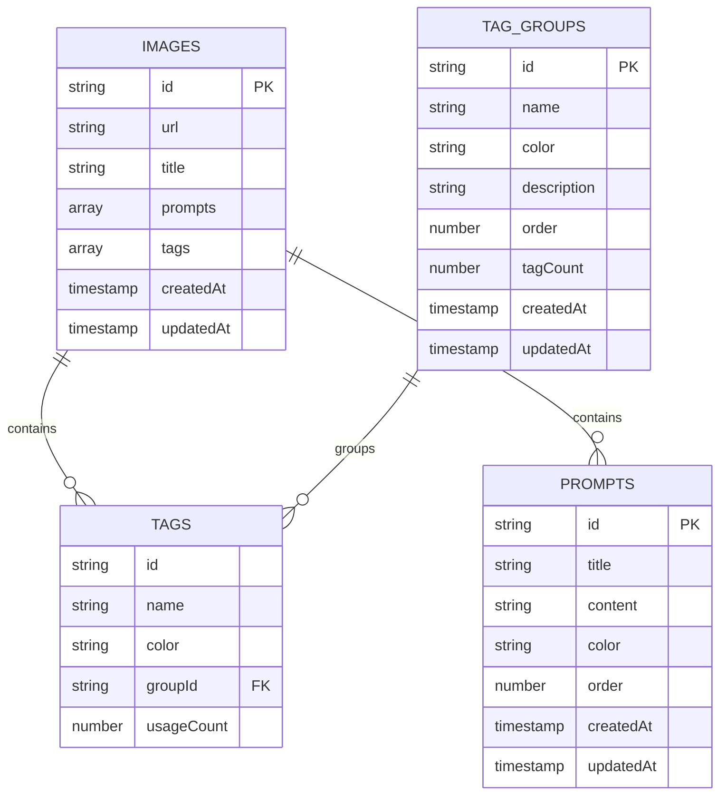
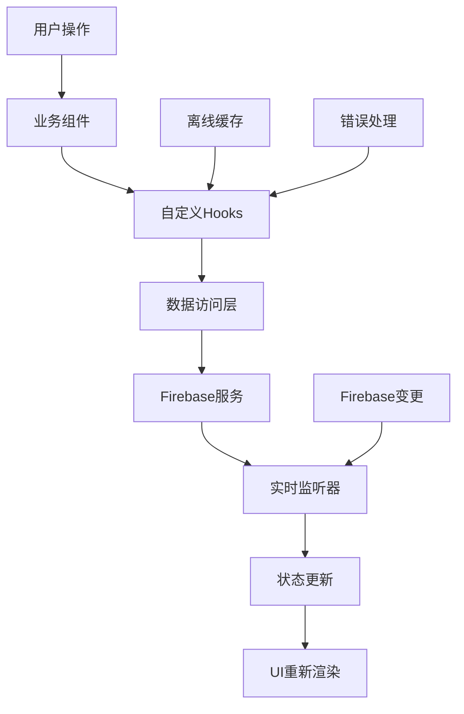
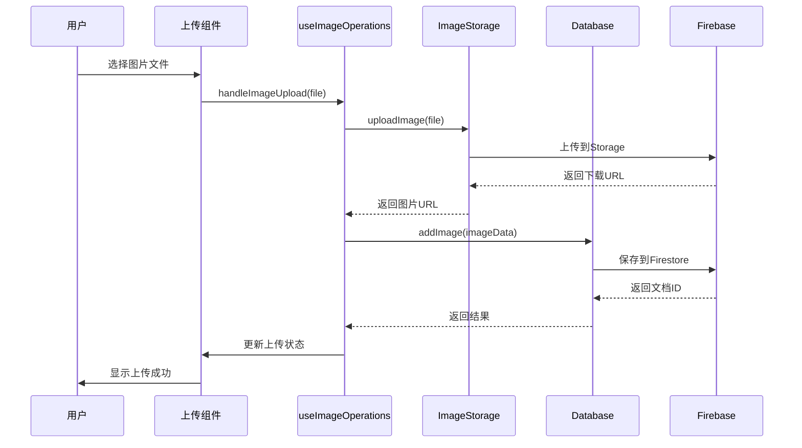
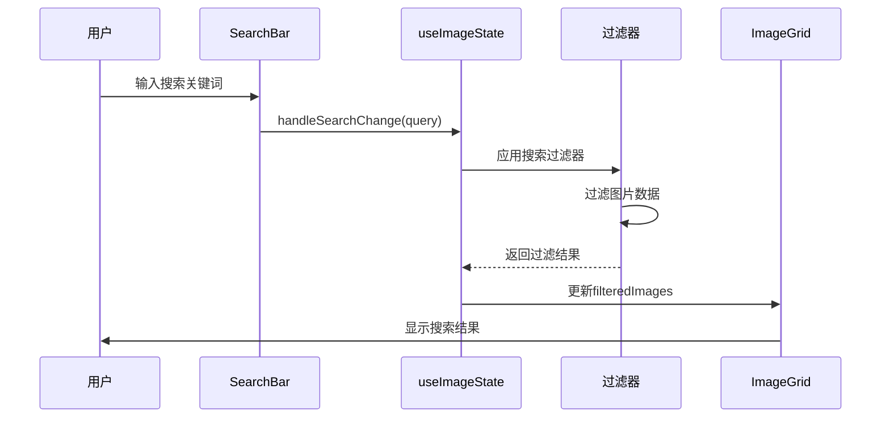
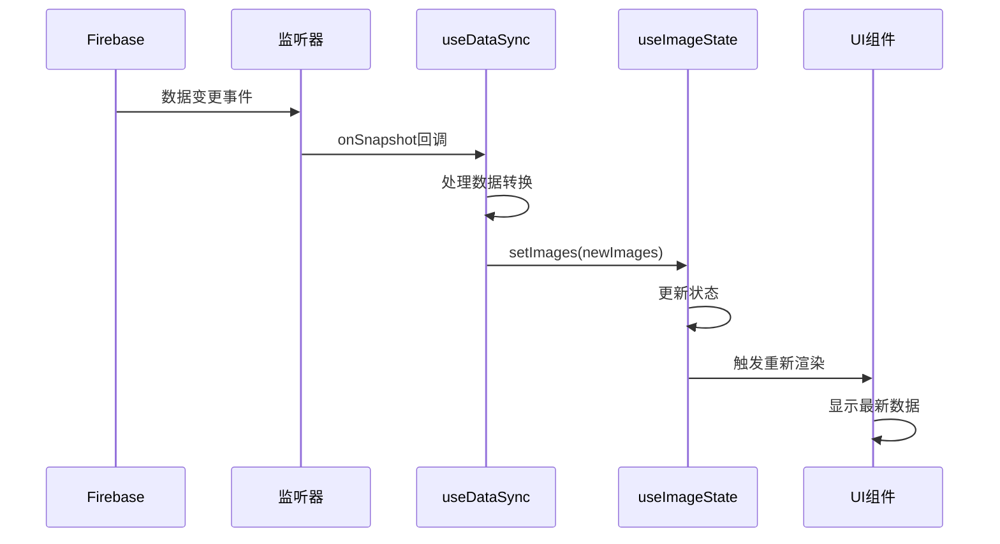
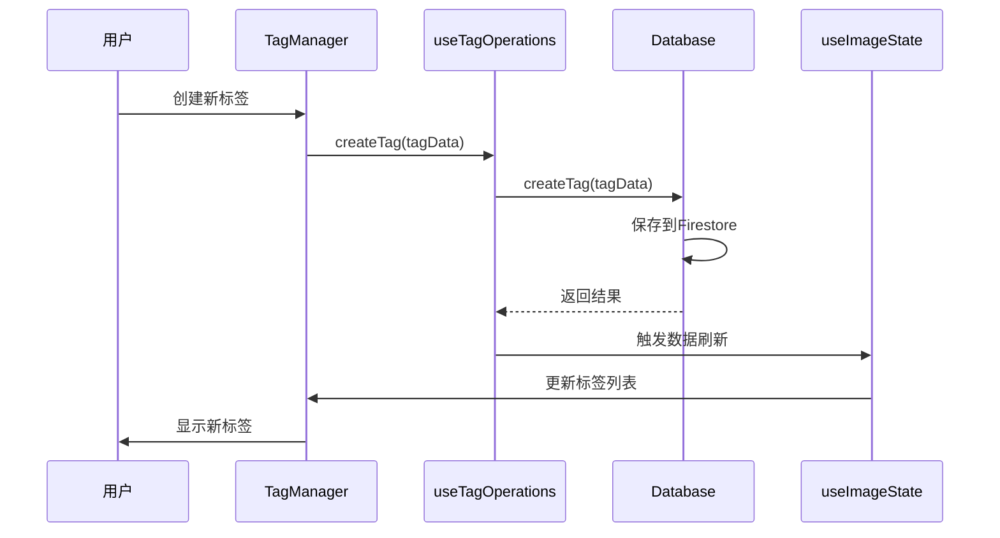
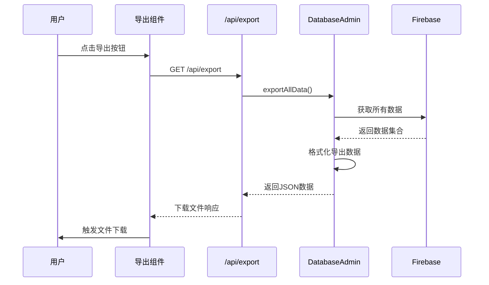

# Gooodcase 项目文档整理

## 📋 目录

1. [项目概述](#项目概述)
2. [类型定义文件](#类型定义文件)
3. [数据库设计文档](#数据库设计文档)
4. [架构/模块设计文档](#架构模块设计文档)
5. [数据流程图/时序图](#数据流程图时序图)
6. [API接口设计](#api接口设计)
7. [样式设计规范](#样式设计规范)

---

## 项目概述

**Gooodcase** 是一个基于 Next.js 和 Firebase 的现代化图片管理应用，支持图片上传、标签管理、搜索和数据导入导出功能。

### 核心功能
- 📸 图片管理（上传、预览、编辑、删除）
- 🏷️ 标签系统（灵活的标签分类和管理）
- 🔍 智能搜索（基于标题、标签和提示词）
- 📱 响应式设计（适配桌面和移动设备）
- ☁️ 云端存储（基于Firebase的实时数据同步）
- 📦 数据导入导出（支持数据备份和迁移）

### 技术栈
- **前端**: Next.js 14, React 18, TypeScript
- **样式**: Tailwind CSS, Framer Motion
- **UI组件**: Radix UI, DND Kit
- **后端**: Firebase (Firestore, Storage)
- **状态管理**: React Hooks + Context

---

## 类型定义文件

### 📁 文件位置
- **主要类型定义**: `types/index.ts`
- **数据库类型**: `lib/database.ts`
- **管理员操作类型**: `lib/database-admin.ts`

### 🔧 核心数据类型

#### 1. 基础实体类型

```typescript
// 基础实体接口
interface BaseEntity {
  id: string;
  createdAt: string;
  updatedAt: string;
}

// 图片数据接口
interface ImageData extends BaseEntity {
  url: string;
  title: string;
  prompts: Prompt[];
  tags: Tag[];
  usageCount?: number;
  isLocal?: boolean;
  isUploading?: boolean;
}

// 标签接口
interface Tag {
  id: string;
  name: string;
  color: string;
  groupId: string;
  order?: number;
  usageCount?: number;
  createdAt?: string;
  updatedAt?: string;
}

// 提示词接口
interface Prompt {
  id: string;
  title: string;
  content: string;
  color: string;
  order: number;
  createdAt?: string;
  updatedAt?: string;
}
```

#### 2. 数据库文档类型

```typescript
// Firestore 图片文档
interface ImageDocument {
  url: string;
  title: string;
  prompts: Prompt[];
  tags: Tag[];
  width: number;
  height: number;
  fileSize: number;
  format: string;
  colorSpace: string;
  hasTransparency: boolean;
  createdAt: string;
  updatedAt: string;
}

// 标签分组文档
interface TagGroupDocument {
  name: string;
  color: string;
  description?: string;
  order: number;
  tagCount: number;
  createdAt: string;
  updatedAt: string;
}
```

#### 3. 应用状态类型

```typescript
// 应用状态
interface AppState {
  images: ImageData[];
  tags: Tag[];
  prompts: Prompt[];
  isLoading: boolean;
  error: string | null;
  connectionStatus: ConnectionStatus;
}

// 搜索过滤器
interface SearchFilters {
  query: string;
  selectedTags: string[];
  sortBy: 'createdAt' | 'updatedAt' | 'title';
  sortOrder: 'asc' | 'desc';
}
```

#### 4. API响应类型

```typescript
// 通用API响应
interface ApiResponse<T = any> {
  success: boolean;
  data?: T;
  error?: string;
  message?: string;
  timestamp: Date;
}

// 数据库操作结果
interface DBResult<T = any> {
  success: boolean;
  data?: T;
  error?: string;
  timestamp: Date;
}
```

### 🎨 颜色主题类型

```typescript
// 颜色主题
interface ColorTheme {
  name: string;
  bg: string;
  text: string;
}

// 预定义颜色主题
const COLOR_THEMES: ColorTheme[] = [
  { name: 'slate', bg: '#f1f5f9', text: '#1e293b' },
  { name: 'amber', bg: '#fef3c7', text: '#c2410c' },
  { name: 'lime', bg: '#ecfccb', text: '#84cc16' },
  { name: 'green', bg: '#dcfce7', text: '#22c55e' },
  // ... 更多颜色主题
];
```

---

## 数据库设计文档

### 🗄️ 数据库架构

**数据库**: Firebase Firestore  
**存储**: Firebase Storage

### 📊 集合结构

#### 1. Images 集合 (`images`)

```
images/
├── {imageId}/
│   ├── url: string              # 图片URL
│   ├── title: string            # 图片标题
│   ├── prompts: Prompt[]        # 关联的提示词
│   ├── tags: Tag[]              # 关联的标签
│   ├── width: number            # 图片宽度
│   ├── height: number           # 图片高度
│   ├── fileSize: number         # 文件大小
│   ├── format: string           # 文件格式
│   ├── colorSpace: string       # 颜色空间
│   ├── hasTransparency: boolean # 是否有透明度
│   ├── createdAt: Timestamp     # 创建时间
│   └── updatedAt: Timestamp     # 更新时间
```

#### 2. Tag Groups 集合 (`tagGroups`)

```
tagGroups/
├── {groupId}/
│   ├── name: string             # 分组名称
│   ├── color: string            # 分组颜色
│   ├── description?: string     # 分组描述
│   ├── order: number            # 排序顺序
│   ├── tagCount: number         # 标签数量
│   ├── createdAt: Timestamp     # 创建时间
│   └── updatedAt: Timestamp     # 更新时间
```

#### 3. Prompts 集合 (`prompts`)

```
prompts/
├── {promptId}/
│   ├── title: string            # 提示词标题
│   ├── content: string          # 提示词内容
│   ├── color: string            # 颜色主题
│   ├── order: number            # 排序顺序
│   ├── createdAt: Timestamp     # 创建时间
│   └── updatedAt: Timestamp     # 更新时间
```

### 🔗 数据关系



### 📝 数据操作模式

#### 1. 实时监听模式
- 使用 Firestore 的 `onSnapshot` 进行实时数据同步
- 支持离线缓存和自动重连
- 监听器管理器统一管理所有监听器

#### 2. 标签提取模式
- 标签不单独存储，从图片数据中动态提取
- 自动计算标签使用次数
- 支持标签分组管理

#### 3. 批量操作模式
- 使用 Firestore 批量写入 (`writeBatch`)
- 支持事务性操作
- 错误回滚机制

---

## 架构/模块设计文档

### 🏗️ 整体架构

```
┌─────────────────────────────────────────────────────────────┐
│                        前端层 (Next.js)                      │
├─────────────────────────────────────────────────────────────┤
│  UI组件层     │  业务组件层    │  页面层        │  API路由层   │
│  - Button     │  - ImageCard   │  - HomePage    │  - /api/*   │
│  - Card       │  - SearchBar   │  - Modal       │             │
│  - Input      │  - TagManager  │  - Sidebar     │             │
├─────────────────────────────────────────────────────────────┤
│                      状态管理层 (Hooks)                       │
├─────────────────────────────────────────────────────────────┤
│  数据层       │  操作层        │  工具层        │  监听层     │
│  - Database   │  - Operations  │  - Utils       │  - Listeners│
├─────────────────────────────────────────────────────────────┤
│                      后端服务层 (Firebase)                    │
├─────────────────────────────────────────────────────────────┤
│  Firestore    │  Storage       │  Auth          │  Functions  │
│  (数据库)     │  (文件存储)    │  (认证)        │  (云函数)   │
└─────────────────────────────────────────────────────────────┘
```

### 📦 模块划分

#### 1. UI组件模块 (`components/ui/`)
- **职责**: 提供基础UI组件
- **特点**: 无状态、可复用、遵循设计系统
- **主要组件**: Button, Card, Input, Dialog, Badge等

#### 2. 业务组件模块 (`components/`)
- **职责**: 实现具体业务逻辑的组件
- **特点**: 有状态、业务相关、组合UI组件
- **主要组件**: ImageCard, SearchBar, TagManager等

#### 3. 状态管理模块 (`hooks/`)
- **职责**: 管理应用状态和业务逻辑
- **特点**: 自定义Hooks、状态隔离、逻辑复用
- **主要Hooks**: useHomePage, useImageState, useDataSync等

#### 4. 数据访问模块 (`lib/`)
- **职责**: 数据库操作和外部服务集成
- **特点**: 单例模式、错误处理、类型安全
- **主要文件**: database.ts, firebase.ts, image-storage.ts等

#### 5. 类型定义模块 (`types/`)
- **职责**: 定义应用中的所有类型
- **特点**: 类型安全、接口统一、文档化
- **主要文件**: index.ts

### 🔄 数据流架构



### 🎯 设计模式

#### 1. 单例模式
- **应用**: Database类、监听器管理器
- **优势**: 确保全局唯一实例，统一管理资源

#### 2. 观察者模式
- **应用**: Firebase实时监听、状态变更通知
- **优势**: 松耦合、响应式更新

#### 3. 组合模式
- **应用**: UI组件组合、Hook组合
- **优势**: 灵活组装、功能复用

#### 4. 策略模式
- **应用**: 不同的排序策略、搜索策略
- **优势**: 算法可替换、易于扩展

---

## 数据流程图/时序图

### 🔄 图片上传流程



### 🔍 搜索流程



### 📊 实时数据同步流程



### 🏷️ 标签管理流程



### 📤 数据导出流程



---

## API接口设计

### 🌐 接口概览

**基础URL**: `http://localhost:3001/api`  
**数据格式**: JSON  
**认证方式**: 无需认证（本地开发环境）

### 📋 接口分类

#### 1. 图片管理接口
- `GET /api/images` - 获取图片列表
- `POST /api/images` - 上传新图片
- `GET /api/images/{id}` - 获取单个图片
- `PUT /api/images/{id}` - 更新图片信息
- `DELETE /api/images/{id}` - 删除图片

#### 2. 标签管理接口
- `GET /api/tags` - 获取所有标签
- `POST /api/tags` - 创建新标签
- `PUT /api/tags/{id}` - 更新标签
- `DELETE /api/tags/{id}` - 删除标签

#### 3. 标签分组接口
- `GET /api/tag-groups` - 获取标签分组
- `POST /api/tag-groups` - 创建标签分组
- `PUT /api/tag-groups/{id}` - 更新标签分组
- `DELETE /api/tag-groups/{id}` - 删除标签分组

#### 4. 数据导入导出接口
- `GET /api/export` - 导出数据
- `POST /api/import` - 导入数据
- `GET /api/export-package` - 导出完整数据包

#### 5. 健康检查接口
- `GET /api/health/firebase` - Firebase连接检查

### 📝 通用响应格式

```json
{
  "success": boolean,
  "data": any,
  "error": string,
  "timestamp": string
}
```

### 🚨 错误处理

| 错误码 | 描述 | 解决方案 |
|--------|------|----------|
| 400 | 请求参数错误 | 检查请求参数格式和必填字段 |
| 404 | 资源不存在 | 确认资源ID是否正确 |
| 500 | 服务器内部错误 | 查看服务器日志，联系开发人员 |

---

## 样式设计规范

### 🎨 设计系统

#### 1. 颜色系统
- **主色调**: `hsl(222.2 47.4% 11.2%)`
- **次要色**: `hsl(210 40% 96%)`
- **强调色**: `hsl(210 40% 96%)`
- **危险色**: `hsl(0 84.2% 60.2%)`

#### 2. 字体系统
- **主字体**: 系统默认字体栈
- **代码字体**: `ui-monospace, SFMono-Regular, "SF Mono", Consolas, "Liberation Mono", Menlo, monospace`

#### 3. 间距系统
- **基础单位**: 4px
- **常用间距**: 8px, 12px, 16px, 24px, 32px, 48px

#### 4. 圆角系统
- **小圆角**: 4px
- **中圆角**: 8px
- **大圆角**: 12px
- **超大圆角**: 24px

### 🧩 组件规范

#### 1. 按钮组件
- **高度**: 40px (默认), 36px (小), 44px (大)
- **内边距**: 16px (水平), 8px (垂直)
- **圆角**: 6px

#### 2. 卡片组件
- **圆角**: 24px
- **阴影**: `0 1px 3px 0 rgb(0 0 0 / 0.1)`
- **内边距**: 24px

#### 3. 输入框组件
- **高度**: 40px
- **边框**: 1px solid
- **圆角**: 6px
- **内边距**: 12px

### 🎭 动画规范

#### 1. 过渡时间
- **快速**: 150ms
- **标准**: 300ms
- **慢速**: 500ms

#### 2. 缓动函数
- **标准**: `cubic-bezier(0.25, 0.46, 0.45, 0.94)`
- **弹性**: `cubic-bezier(0.68, -0.55, 0.265, 1.55)`

#### 3. 常用动画
- **悬停**: `scale(1.05)`, `translateY(-2px)`
- **点击**: `scale(0.95)`
- **淡入**: `opacity: 0 → 1`

---

## 📚 开发指南

### 🚀 快速开始

1. **克隆项目**
   ```bash
   git clone [repository-url]
   cd good3
   ```

2. **安装依赖**
   ```bash
   npm install
   ```

3. **配置环境变量**
   ```bash
   cp .env.example .env.local
   # 编辑 .env.local 配置 Firebase
   ```

4. **启动开发服务器**
   ```bash
   npm run dev
   ```

### 📁 项目结构

```
good3/
├── app/                 # Next.js App Router
│   ├── api/            # API 路由
│   ├── globals.css     # 全局样式
│   └── page.tsx        # 主页面
├── components/         # React 组件
│   ├── ui/            # 基础 UI 组件
│   ├── tags/          # 标签相关组件
│   └── ...            # 其他业务组件
├── hooks/             # 自定义 Hooks
├── lib/               # 工具库和服务
├── types/             # TypeScript 类型定义
├── public/            # 静态资源
└── scripts/           # 构建和部署脚本
```

### 🔧 开发规范

#### 1. 代码规范
- 使用 TypeScript 进行类型检查
- 遵循 ESLint 和 Prettier 配置
- 组件使用 PascalCase 命名
- 文件使用 kebab-case 命名

#### 2. 组件规范
- 优先使用函数组件和 Hooks
- 保持组件单一职责
- 使用 TypeScript 接口定义 Props
- 添加适当的错误边界

#### 3. 状态管理规范
- 使用自定义 Hooks 封装业务逻辑
- 避免 prop drilling，使用 Context 传递深层状态
- 保持状态的不可变性
- 合理使用 useMemo 和 useCallback 优化性能

### 🧪 测试策略

#### 1. 单元测试
- 测试工具函数和 Hooks
- 测试组件的基本渲染和交互
- 使用 Jest 和 React Testing Library

#### 2. 集成测试
- 测试组件间的交互
- 测试数据流和状态管理
- 模拟 Firebase 服务

#### 3. 端到端测试
- 测试完整的用户流程
- 使用 Playwright 或 Cypress
- 覆盖关键业务场景

---

## 📈 性能优化

### 🚀 前端优化

1. **代码分割**
   - 使用 Next.js 动态导入
   - 按路由分割代码
   - 懒加载非关键组件

2. **图片优化**
   - 使用 Next.js Image 组件
   - 实现图片懒加载
   - 支持 WebP 格式

3. **状态优化**
   - 使用 useMemo 缓存计算结果
   - 使用 useCallback 避免不必要的重渲染
   - 实现虚拟滚动

### 🔥 后端优化

1. **数据库优化**
   - 合理设计 Firestore 索引
   - 使用分页查询
   - 实现数据缓存

2. **网络优化**
   - 启用 Firebase 离线持久化
   - 实现请求去重
   - 使用 CDN 加速

---

## 🔒 安全考虑

### 🛡️ 数据安全

1. **Firebase 安全规则**
   ```javascript
   rules_version = '2';
   service cloud.firestore {
     match /databases/{database}/documents {
       match /{document=**} {
         allow read, write: if true; // 开发环境
       }
     }
   }
   ```

2. **输入验证**
   - 客户端和服务端双重验证
   - 防止 XSS 攻击
   - 文件类型和大小限制

3. **环境变量保护**
   - 敏感信息存储在环境变量中
   - 不在客户端暴露私钥
   - 使用 Firebase 安全规则控制访问

---

## 📊 监控和日志

### 📈 性能监控

1. **前端监控**
   - 使用 Web Vitals 监控性能指标
   - 实现错误边界捕获异常
   - 监控用户行为和交互

2. **后端监控**
   - Firebase 性能监控
   - 数据库查询性能分析
   - API 响应时间监控

### 📝 日志系统

1. **客户端日志**
   ```typescript
   console.log('📊 监听器状态:', status);
   console.error('图片监听错误:', error);
   ```

2. **服务端日志**
   - Firebase Functions 日志
   - 错误追踪和报告
   - 用户操作审计

---

## 🚀 部署指南

### 🌐 生产部署

1. **构建项目**
   ```bash
   npm run build
   ```

2. **环境配置**
   - 配置生产环境变量
   - 设置 Firebase 安全规则
   - 配置域名和 SSL

3. **部署平台**
   - Vercel (推荐)
   - Netlify
   - Firebase Hosting

### 🔄 CI/CD 流程

1. **自动化测试**
   - 代码提交触发测试
   - 通过测试后自动部署
   - 失败时回滚机制

2. **部署策略**
   - 蓝绿部署
   - 金丝雀发布
   - 热更新支持

---

## 📞 联系信息

**项目维护者**: 开发团队  
**文档版本**: v1.0  
**最后更新**: 2024-01-01  
**技术支持**: [技术支持邮箱]

---

*本文档将随着项目的发展持续更新，请定期查看最新版本。*